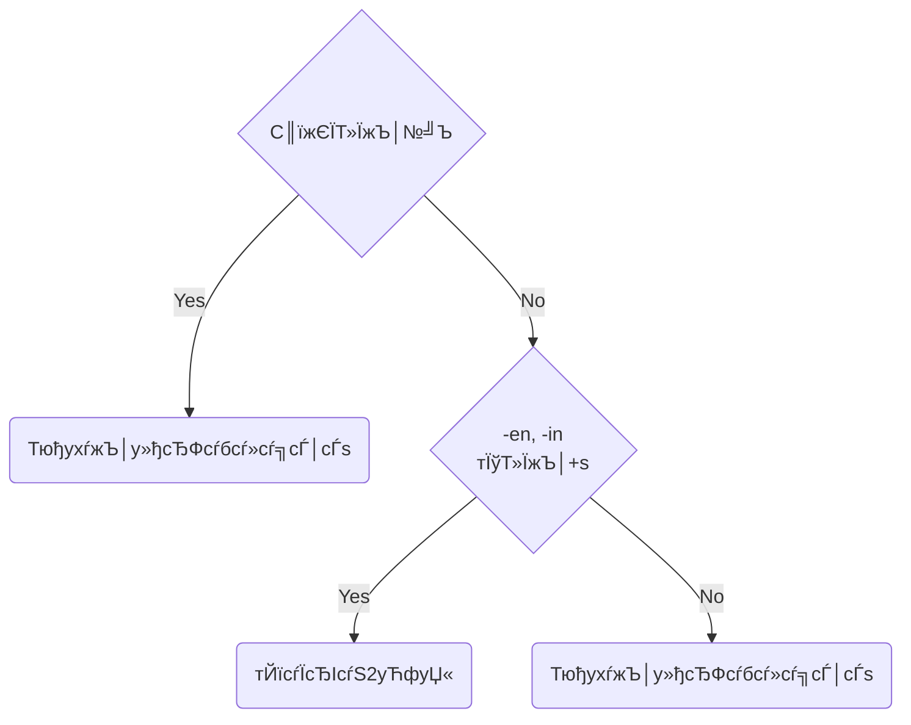

# Accent -ca

## Irregular

СИЇУдЈтЅЄсЂ«та┤тљѕсЂ»сѓбсѓ»сѓ╗сЃ│сЃѕУеўтЈисЂїсЂцсЂЈ

## Regular

<aside>
­ЪњА тЁесЂдсђЂТюђухѓжЪ│у»ђсЂДТ▒║сЂЙсѓІ

</aside>

```mermaid
graph TD
   A{С║їжЄЇТ»ЇжЪ│№╝Ъ}
   A -->|Yes| B(ТюђухѓжЪ│у»ђсЂФсѓбсѓ»сѓ╗сЃ│сЃѕ)
   A -->|No| C{-en, -in<br>тЇўТ»ЇжЪ│+s}
   C --> |Yes| D(тЙїсѓЇсЂІсѓЅ2уЋфуЏ«)
   C -->|No| E(ТюђухѓжЪ│у»ђсЂФсѓбсѓ»сѓ╗сЃ│сЃѕ)
```