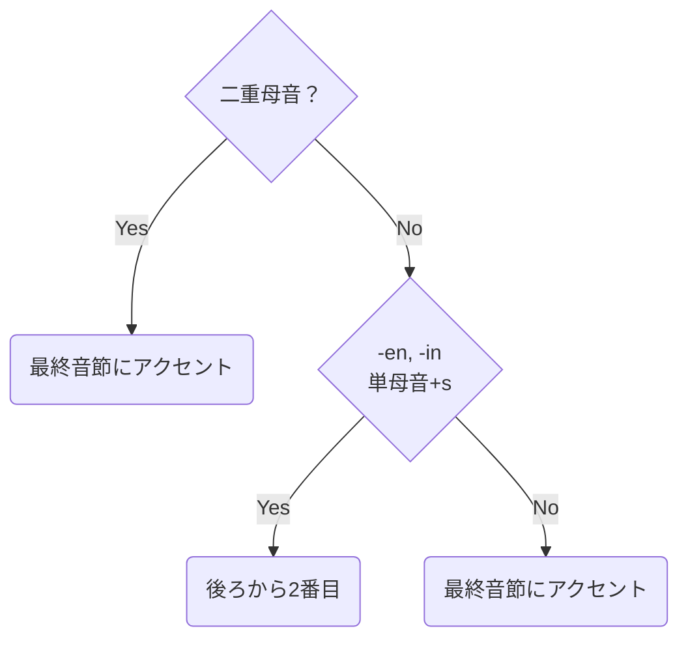

# Accent -ca

## Irregular

不規則の場合はアクセント記号がつく

## Regular

<aside>
💡 全て、最終音節で決まる

</aside>

```mermaid
graph TD
   A{二重母音？}
   A -->|Yes| B(最終音節にアクセント)
   A -->|No| C{-en, -in<br>単母音+s}
   C --> |Yes| D(後ろから2番目)
   C -->|No| E(最終音節にアクセント)
```