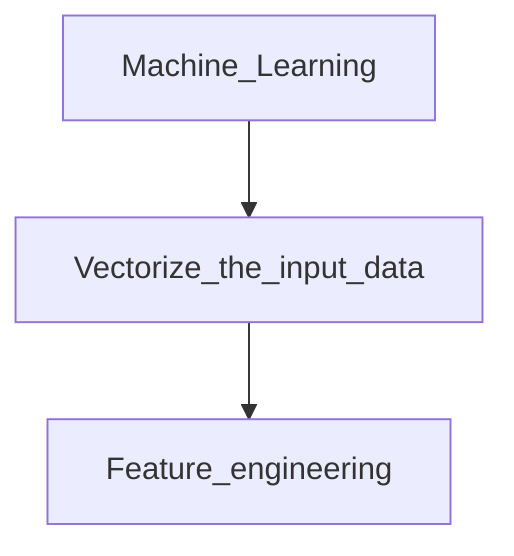

各言語版のWikipediaで「自然言語処理」の説明各言語のWikipediaの“NaturalLanguageProcessing”の記事の冒頭をChatGPTで日本語で翻訳してもらいました。英語 自然言語処理（NLP）は、コンピュータサイエンスと情報検索の学際的な分野です。主に、コンピュータが人間の言語をサポートし操作する能力を持つことを目指しています。自然言語データセット（テキストコーパスや音声コーパスなど）を処理するには、ルールベースまたは確率的（つまり、統計的および最近ではニューラルネットワークベースの）機械学習アプローチを使用します。目標は、文書の内容を「理解」し、その中の言語の文脈的なニュアンスを把握できるコンピュータを作ることです。この目的のために、自然言語処理は理論言語学のアイデアを借りることがよくあります。この技術により、文書に含まれる情報や洞察を正確に抽出し、文書自体を分類・整理することができます。自然言語処理における課題は、しばしば音声認識、自然言語理解、および自然言語生成に関わります。 ヘブライ語 自然言語処理（ヘブライ語עיבודשפהטבעית,英語NaturalLanguageProcessingNLP）は、人工知能と言語学のサブフィールドです。自然言語の処理と操作、そして自然言語の理解に関連する問題を扱い、コンピュータが人間の言語で話されたり書かれたりした内容を「理解」できるようにすることを目的としています。自然言語処理は計算言語学の分野と関連しており、これらの用語は区別なく使われることがあります。ここでは、自然言語処理を人間の言語を扱うコンピュータアプリケーションの開発という実践的な分野として扱います。「計算言語学」という用語は、人間の言語研究におけるコンピュータサイエンスのアイデアを統合する理論的な側面を扱います。ペルシャ語 自然言語処理は、コンピュータサイエンスと人工知能の重要なサブフィールドの一つであり、コンピュータと人間の（自然）言語の間の相互作用に取り組んでいます。したがって、自然言語処理は人間とコンピュータのコミュニケーションに焦点を当てています。この分野の主な課題は、自然言語の理解と、自然な人間の言語で表現された概念を理解し取り込むプロセスを機械化することです。より具体的に言えば、自然言語処理とは、音声言語と書記言語を処理するためにコンピュータを使用することを指します。つまり、コンピュータが自然な言語の形式と構造で生成された話し言葉や書き言葉を分析し理解するか、またはそれを生成できるようにすることを意味します。これにより、言語の翻訳を行ったり、ウェブページや書き情報のデータベースから質問に答えたり、デバイスと会話して相談したりすることが可能になります。これらは自然言語処理の多様な応用例の一部に過ぎません。オンラインの自動応答アシスタントがウェブページでカスタマーサービスを提供することは、自然言語処理が主要な部分を占めるアプリケーションの一例です。自然言語処理の主な目的は、コンピュータサイエンスに存在するアルゴリズムとデータ構造を用いて、言語の計算理論を作成することです。この目標を達成するためには、言語に関する広範な知識が必要であり、コンピュータサイエンスの研究者だけでなく、言語学者の知識も必要とされます。言語情報を処理することで、自然言語を扱うための統計情報を抽出することができます。自然言語処理の応用は大きく分けて、書き言葉の応用と話し言葉の応用に分けられます。書き言葉の応用例としては、特定の情報をテキストから抽出すること、テキストを他の言語に翻訳すること、またはデータベース内の特定の文書（例えば、図書館内の関連書籍）を見つけることが挙げられます。話し言葉の自然言語処理の応用例としては、人間とコンピュータの質問応答システム、電話を通じた自動カスタマーサービス、学習者への教育システム、または音声による制御システムがあります。近年、この分野の研究は多くの科学者の注目を集め、多くの研究が行われています。ロシア語 自然言語処理（NaturalLanguageProcessing,NLP）は、人工知能と数理言語学の一般的な分野です。これは、自然言語のテキストのコンピュータ解析と合成の問題を研究します。人工知能に関連して、解析は言語の理解を意味し、合成は文法的に正しいテキストの生成を意味します。F280418B3A8A41E992B21FF33A9A1B84F280418B3A8A41E992B21FF33A9A1B84中国語A8DE2CA44322451EAA61315FB38864C3A8DE2CA44322451EAA61315FB38864C3自然言語処理（英語NaturalLanguageProcessing、略してNLP）は、人工知能と言語学の分野の一部です。この分野では、自然言語の処理と利用について研究しています。自然言語処理には、認知、理解、生成など多くの側面とステップが含まれます。自然言語の認知と理解は、コンピュータが入力された言語を有意味な記号と関係に変換し、目的に応じて処理することを意味します。自然言語生成システムは、コンピュータのデータを自然言語に変換するものです。自然言語処理では、言語能力と言語応用を表すモデルを開発し、言語モデルを実現して改善するための計算フレームワークを構築し、そのモデルに基づいてさまざまな実用システムを設計し、これらのシステムの評価技術を探求します。41C60C112DFA44FA9D16B3E9A9B88AC041C60C112DFA44FA9D16B3E9A9B88AC0韓国語1CE5C0DAB4E94AB9A2C97158877452FF1CE5C0DAB4E94AB9A2C97158877452FF自然語処理（NLP）または自然言語処理は、人間の言語現象をコンピュータなどの機械を使用して記述し、実装するための人工知能の主要な分野の一つです。自然言語はコンピュータが理解するためにプログラミング言語で処理する必要があり、コンピュータが自然言語を認識または生成できるようにすることが自然言語処理です。自然言語処理は、言語そのものを研究する言語学や言語現象の内的構造を探求する言語認知科学と深く関連しています。実装のために、数学的・統計的ツールを多く活用し、特に機械学習ツールを多く使用する代表的な分野です。情報検索、QAシステム、文書の自動分類、新聞記事のクラスタリング、対話型エージェントなど、さまざまな応用が行われています。Wikipedia

# AI

[The Difference Between AI, Machine Learning, and Deep Learning? | NVIDIA Blog](https://blogs.nvidia.com/blog/whats-difference-artificial-intelligence-machine-learning-deep-learning-ai/)

# Machine Learning

[Supervised Learning](AI%20cf8e722de06f492093684da142a888b5/Supervised%20Learning%20956457ebb2b54179920238f73d9e9758.md)

[Unsupervised Learning](AI%20cf8e722de06f492093684da142a888b5/Unsupervised%20Learning%20b453a2aa4fbc4eefb4bb98259d7967b4.md)

[Reinforcement Learning](AI%20cf8e722de06f492093684da142a888b5/Reinforcement%20Learning%207789a2ce4ae4401ea18d7009fb1c4282.md)

[論文多読](AI%20cf8e722de06f492093684da142a888b5/%E8%AB%96%E6%96%87%E5%A4%9A%E8%AA%AD%20ab0b75d679c14474a7820cd1637a6646.md)

Open sidebarAIの種類の一覧

ルールベースシステム（1960年代-1980年代） - 人間がルールを決め、それに基づいて推論を行うシステム。初期のAIの代表的な手法である。

専門家システム（1970年代-1990年代） - 特定の分野の知識を持つ人間（専門家）が知識を提供し、それをもとに推論を行うシステム。医療や法律などの分野で活躍した。

機械学習（1980年代-現在） - データからパターンを学習し、そのパターンをもとに予測や判断を行う。教師あり学習、教師なし学習、強化学習などがある。

ニューラルネットワーク（1980年代-現在） - 生物の神経細胞の仕組みを模倣して構築されたネットワークで、画像認識や音声認識などの分野で高い精度を示す。

遺伝的アルゴリズム（1980年代-現在） - 進化論的なアプローチを用いて、最適な解を求める手法。最適化問題や設計問題などで利用される。

エキスパートシステム（1980年代-現在） - 専門家の知識をルールベースシステムで表現し、それに基づいて推論を行うシステム。専門家システムと類似するが、より汎用的なシステムとなっている。

エージェントシステム（1990年代-現在） - 自律的に行動し、環境と相互作用するシステム。マルチエージェントシステムなども存在する。

知識表現（1990年代-現在） - ルールやファジィロジックなど、知識を表現するための方法を研究する分野。推論エンジンや知識ベースの構築などに応用される。

自然言語処理（1990年代-現在） - 自然言語の理解や生成を行う技術。機械翻訳や質問応答システムなどのアプリケーションで活躍している。

意思決定支援システム（1990年代-現在） - 意思決定に必要な情報を収集し、分析・評価するシステム。マルチクライテリア意思決定や専門家意見の統合などが研究されている。

感情推定・分析（2000年代-現在） - テキストや音声などから人の感情を推定・分析する技術。SNSの監視やコールセンターの自動応答などで利用される。

ロボット技術（2000年代-現在） - AIとロボット技術を組み合わせた研究が進んでおり、工場や倉庫などでの自動化や介護ロボットなどの開発が進んでいる。

深層学習（2010年代-現在） - 大規模なデータセットを用いて多層のニューラルネットワークを学習させる技術。画像認識や音声認識などの分野で高い精度を示す。

機械読解（2010年代-現在） - 質問と回答のペアを学習し、テキストから回答を生成する技術。自然言語処理の一分野であり、質問応答システムや文書検索エンジンなどに応用される。

自己学習型システム（2010年代-現在） - データを自己で収集し、学習するシステム。教師なし学習や強化学習などの手法が利用され、画像認識やゲームのプレイなどで高い成果を上げている。

グラフィカルモデル（2010年代-現在） - データ間の因果関係を表現するグラフ構造を用いたモデル。ベイジアンネットワークや因果推論などが研究されている。

生成モデル（2010年代-現在） - データを生成するモデル。Generative Adversarial Networks（GAN）やVariational Autoencoders（VAE）などが研究されている。画像生成や音声合成などのアプリケーションに応用される。

AIエシックス（2010年代-現在） - AIによる社会的影響や倫理的問題に対する研究が進んでおり、AI倫理やデータプライバシーなどが議論されている。これらの種類以外にも、常に新しいAIの技術や応用が研究されています。近年では、COVID-19のパンデミックの影響によって、AIの医療分野での応用が加速しています。また、量子コンピュータを用いたAIの研究も進んでおり、さらなる飛躍が期待されています

自然言語処理（NLP）の発展に伴い、様々なNLPソフトウェアが開発されてきました。以下に、GPTに至るまでの主要なNLPソフトウェアを時系列順に列挙します。

ELIZA（1966年）- コンピュータとの自然な対話を実現することを目的とした、初のチャットボット。

SHRDLU（1972年）- ロボットとの自然な対話を可能にすることを目的として開発された、自然言語処理の先駆的なシステム。

XCON（1980年代）- エキスパートシステムの一つで、自然言語を使用してユーザーと対話し、問題解決のためのアドバイスを提供する。

WordNet（1985年）- 単語の意味と関係性を体系的に整理した英語の辞書。自然言語処理の分野で広く用いられる。

FUF/SURGE（1980年代-1990年代）- 自然言語の解析・生成を行うシステム。フレームベースの処理を用い、当時の自然言語処理の主流であった規則ベースの手法とは異なるアプローチをとった。

ハプニング（1990年代）- パターンマッチングや手作業で作成した辞書を用いて、音声認識や対話を行うシステム。家庭用の対話型ロボット「ピーピー」に搭載された。

ノーリツのヒーター制御システム（1995年）- 音声入力による家電の制御を実現した、初の商用音声認識システム。

MeCab（2000年代）- 日本語の形態素解析エンジン。オープンソースで開発され、広く利用されている。

Google翻訳（2006年）- 機械学習を用いた翻訳エンジン。ニューラルネットワークを採用することで、従来の統計ベースの手法より高い精度を実現した。

Siri（2011年）- Appleが開発した、音声認識と自然言語処理を組み合わせた音声アシスタント。人工知能の発展に大きな影響を与え

Watson（2011年

IBMが開発した、自然言語処理と人工知能を組み合わせたシステム。クイズ番組Jeopardy!で人間のトッププレイヤーに勝利するなどの実績を残した。

BERT（2018年）- Googleが開発した、自然言語処理のタスクにおいて最高水準の精度を誇るニューラルネットワークモデル。言語モデルのプレトレーニングにより、膨大なデータから学習することで高い性能を実現した。

GPT-2（2019年）- OpenAIが開発した、自然言語生成タスクにおいて最高水準の性能を誇るニューラルネットワークモデル。1.5億個のパラメータを持ち、人間に近い文章を生成することができる。

GPT-3（2020年）- OpenAIが開発した、GPT-2よりもさらに大きな規模のニューラルネットワークモデル。1.75兆個のパラメータを持ち、様々な自然言語処理タスクにおいて高い性能を発揮する。一部の専門家からは、AI史上最も重要な発展の一つとされる。

Watson(2011)

IBMが開発した、自然言語処理と人工知能を組み合わせたシステム。クイズ番組Jeopardy!で人間のトッププレイヤーに勝利するなどの実績を残した。

BERT（2018年

Googleが開発した、自然言語処理のタスクにおいて最高水準の精度を誇るニューラルネットワークモデル。言語モデルのプレトレーニングにより、膨大なデータから学習することで高い性能を実現した。

GPT-2（2019年）- OpenAIが開発した、自然言語生成タスクにおいて最高水準の性能を誇るニューラルネットワークモデル。1.5億個のパラメータを持ち、人間に近い文章を生成することができる。

GPT-3（2020年）- OpenAIが開発した、GPT-2よりもさらに大きな規模のニューラルネットワークモデル。1.75兆個のパラメータを持ち、様々な自然言語処理タスクにおいて高い性能を発揮する。一部の専門家からは、AI史上最も重要な発展の一つとされる。