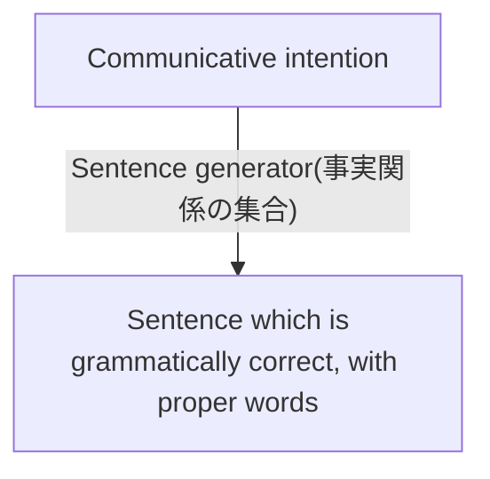

# NLP, Corpus

[Untitled](NLP,%20Corpus%20c05466bf6c9e40b5adbf7656bcf7ab85/Untitled%20114496eb7c9080988b66ff2a82638573.csv)

[Conjugation list](NLP,%20Corpus%20c05466bf6c9e40b5adbf7656bcf7ab85/Conjugation%20list%2021e0259f8d754f4abd8f49397a0eda32.csv)

[Model -nlp](NLP,%20Corpus%20c05466bf6c9e40b5adbf7656bcf7ab85/Model%20-nlp%2097baa8a9de9f4aabaa7eeecd134c67d5.md)

[Corpus](NLP,%20Corpus%20c05466bf6c9e40b5adbf7656bcf7ab85/Corpus%2087d97ff019a4455ea57b1728c5527f16.md)

- 単語のベクトル表現
    - 素性関数
    - 単語文脈行列（分布仮説基づき）
        - PMI
            
            pointwise mutual information
            
            情報理論に於いて
            
    - 特異値分解で次元圧縮
    - Word2Vec
        
        ニューラルネットワークを使った学習
        
    - 単語ベクトルの応用
        - 単語の類似度
        - アナロジー
            
            パリ-フランス+イタリア=ローマ
            
    - 未知語（語彙目録にない新語）への対応、Subwordに注目するFastText

[知識工学](NLP,%20Corpus%20c05466bf6c9e40b5adbf7656bcf7ab85/%E7%9F%A5%E8%AD%98%E5%B7%A5%E5%AD%A6%2030f9300a84f847e8b2bf0fa6eb6b7c0e.md)

# 「文生成は、文理解の逆プロセスを辿ればいい」

# 「自然言語理解では関心が払われない問題に取り組まなければならない」

# 言語の科学：数理科学

- 文からテクストへ
    
    文生成: あらゆる自然言語生成システムの基本となる構成要素。
    
    ### 自然言語生成の中心的な問題
    
    これがわかれば、文生成が満たすべき要件も自然に見えてくる。