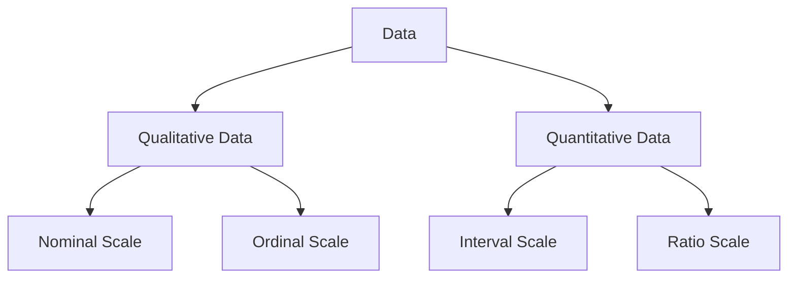

# [EXP]Statistics and Math

# 内面

データセットの**平均**（期待値）と**分散**（標準偏差）と、確率変数のそれらはやや異なるもの。FrequentismとBeyesianismの関係と同じ？

### **Statistics of Datasets vs Theoretical Statistics of Random Variables:**

- **Mean and Variance of Datasets:** These are calculated based on the actual values obtained from the data. They are sometimes referred to as "sample mean" and "sample variance."
- **Expected Value and Variance of Random Variables:** These are theoretical values defined based on the probability distribution. They are sometimes referred to as "population mean" and "population variance."

The sample mean and sample variance are considered estimators of the expected value and variance of random variables, but due to the finiteness of the sample data, they may not completely match the population parameters.

### 2. **Relationship between Frequentism and Bayesianism:**

- **Frequentism:** Interprets probability based on long-term frequency. It considers the parameters of the population to be fixed and estimates these parameters from the data. For frequentists, parameters are constants and are estimated based on the data.
- **Bayesianism:** Interprets probability as a degree of subjective belief. It treats parameters themselves as random variables and updates the posterior distribution based on prior distribution and data. For Bayesians, parameters have uncertainty as beliefs about them change with the data.

### Data type

- Data type in computer science
    - Boolean
    - Integer
    - Float
    
    …
    
- Data type in algebra
    
    group, ring, field
    

**Nominal**

- 性別
- 名前

**Ordinal**

- 1年生, 2年生, 3年生, …
- 

**Interval**

- 

**Ratio**

- 

## データも確率変数も、「中心」と「散らばり」を出す！

## Probability

[Probability](%5BEXP%5DStatistics%20and%20Math%2098d6da7bddc242dfbc883c70cd13a29b/Probability%2020f740e198de4827bd57faf37cf7ba25.md)

Frequentism: Population parameterをInvariableとして扱う

### Descriptive

データの特徴を把握する

←データの要約[統計量]/可視化[グラフ化]

←データの加工・整理

[Descriptive statistics](%5BEXP%5DStatistics%20and%20Math%2098d6da7bddc242dfbc883c70cd13a29b/Descriptive%20statistics%208af9df94bbc04768814cac1f449c0b7b.md)

### Inferential

標本から母集団の特徴を把握する

[Inferential statistics](%5BEXP%5DStatistics%20and%20Math%2098d6da7bddc242dfbc883c70cd13a29b/Inferential%20statistics%20f8c7514fe4d64bf6b1fb2d00717fa2f5.md)

ベイズの定理

ベイズ理論の応用

母数、展開公式、

# 外面

[Law and statistics](%5BEXP%5DStatistics%20and%20Math%2098d6da7bddc242dfbc883c70cd13a29b/Law%20and%20statistics%2073882bd7e5e34cac93a4df27208d9d1d.md)

[Algebra](%5BEXP%5DStatistics%20and%20Math%2098d6da7bddc242dfbc883c70cd13a29b/Algebra%2072f57364fa0743a092de53ab23f66b4c.md)

[Analysis](%5BEXP%5DStatistics%20and%20Math%2098d6da7bddc242dfbc883c70cd13a29b/Analysis%20ae797647a55748318b6bf3dccf0696fb.md)

[Digital Mathematics](%5BEXP%5DStatistics%20and%20Math%2098d6da7bddc242dfbc883c70cd13a29b/Digital%20Mathematics%20edcdb874524f4c1fb804d08b1b8a83ec.md)

[Linear algebra](%5BEXP%5DStatistics%20and%20Math%2098d6da7bddc242dfbc883c70cd13a29b/Linear%20algebra%202e75578ec0d44967b0221f401c84b6d9.md)

[難しい数式の対処法](%5BEXP%5DStatistics%20and%20Math%2098d6da7bddc242dfbc883c70cd13a29b/%E9%9B%A3%E3%81%97%E3%81%84%E6%95%B0%E5%BC%8F%E3%81%AE%E5%AF%BE%E5%87%A6%E6%B3%95%203ae449b210204c7e9059b496849d7016.md)

[Geometry](%5BEXP%5DStatistics%20and%20Math%2098d6da7bddc242dfbc883c70cd13a29b/Geometry%209099232464864724b3f03413cf6a032c.md)

[Applied Mathematics](%5BEXP%5DStatistics%20and%20Math%2098d6da7bddc242dfbc883c70cd13a29b/Applied%20Mathematics%20d6fff43380514dfba40a2bcd963f0e01.md)