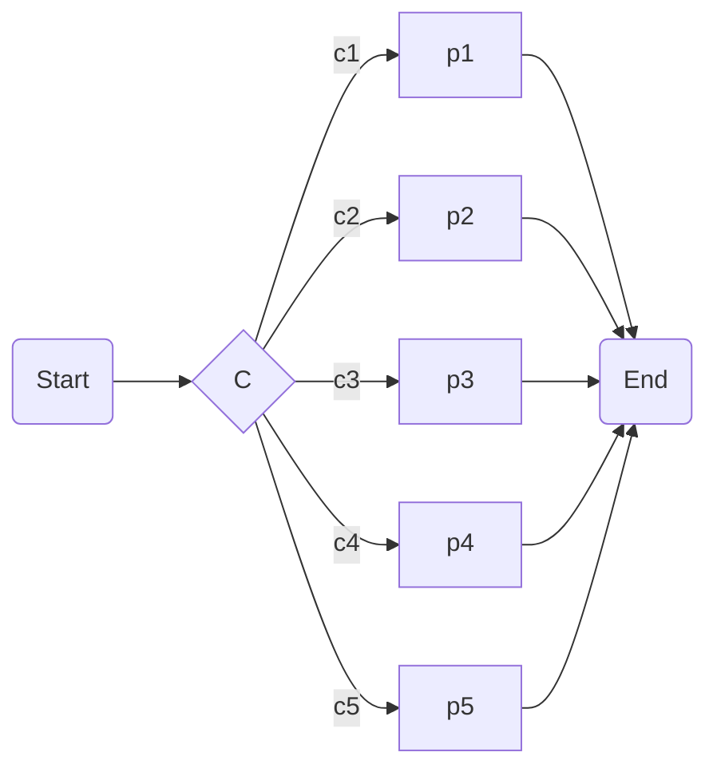
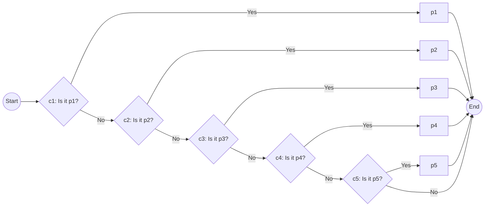

全ての処理は順次/分岐/反復で表せる" は嘘。
分からないとやばいプログラムとプロセスの違い
プログラムは、パーティーのプログラムのように、あるものの段取りを前から順番に記録していくものです。原初のプログラミングも、全く同じでした。

忌み嫌われるGoTo文の話
結局、「実際の開発でないと困るもの」が残っている。
分岐
反復/継続
例外処理
非同期処理/並列処理

## 1つの条件分岐ブロックから**2本**生える時
書き方が二つある。
    
### [書き方1] 条件がtruthyだった時の処理のみ書く        
```jsx
if (condition){
    // processing
}
```
### [書き方2] 条件がtruthyだった時の処理とfaulsyだった時の処理をどちらも書く
それぞれの文字列がフロー図の何を表しているのかを理解する。
truthyだった時の処理: `{}`
faulsyだった時の処理: `else{}`        
```jsx
if (condition){
    // processing for truthy
} else {
    // processing for faulsy
}
```
## 1つの条件分岐ブロックから**2本より多く**生える時
### 理想を言えばこんなのが書けらたらいいよね。     

### でもそれは現実的ではない。

        
`else if`と書いているが、実際は下のようなイメージ。

```jsx
if(c1){

            }
else
            {
                    if(c2){

                                }
                        else{
                                        if(c3){

                                                    }
                                            else{

                                                    }
                                }
            }
```
2又を組み合わせればどんな複雑な条件分岐でも表現することができる。
(メモ)直感的だけど論理回路に似てる。