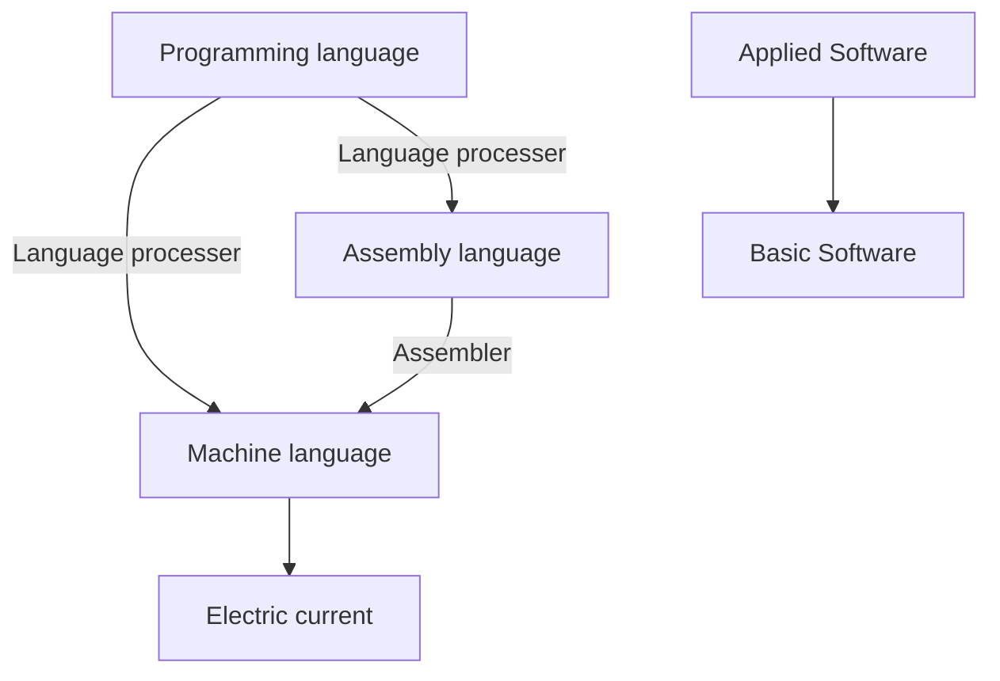

データ量>単位覚えよう。

そのままKindle本にする。

料理の譬えが分かりやすい！

Since every piece of hardware has software to run it, it might be a good idea to restructure the page accordingly.

Anatomy and physiology perfectly correspond to hardware and software.

解剖生理

- 「時間や確率を計算する」系の問題
    
    絶対何かあるな。CやC++で必要になるんだろうな。早く解りたい。じゃないと、「また計算系でてきた、なんで？」となって本質的理解ができない気がするから。

組み込みシステム

センサ -A/D変換→コンピュータ-D/A変換→アクチュエータ

- 制御方法
- シーケンス制御
    
    決められた処理を前から順にこなしていく
    
- フィードバック制御
    
    現状を定期的に計測し、計測値と目標値を一致させようとする制御方式
    

[Math](%5BEXP%5DCS%201004a5f02ff948a8be774e816e71a1c9/Math%20da08a65024bb4d569d979fe5c13ffcd8.md)

[USB PDとは？（USB Power Delivery） | サンワサプライ株式会社](https://www.sanwa.co.jp/product/cable/howto/usb_pd.html)

スループットは、単位時間あたりにできる仕事量

CPUの作り方

---

OSは低級“言語”じゃないよ

ソフトウェアの自動化をRPAという。

最終目標は機械語ではない！最終目標は「処理」！

電流も言語なの、いいな。人間の中でも神経を流れる電気信号がOS



# Basic software広義のOS

提供するためのさまざまなソフトウェアコンポーネントを含むものです

---

制御プログラム(Kernel, 狭義のOS)

言語プロセッサ

サービスプログラム

- プロセススケジューラ
- ファイルシステム
- Device management

プロセスがハードウェアにアクセスする時、カーネルの中の「デバイスドライバ」というソフトウェアが、ユーザの代わりにハードウェアを操作する。

デバイス固有の操作には `ioctl()` というsystem-callを使う。Rootのみがdevice fileにアクセスできる。

- device file
    
    デバイスファイルに保存されている情報
    
    - Type of file
    - Major number/Minor number of device
    - `c`: Character device
        
        読み出し: 端末からデータを出力`read()` 
        
        書き出し: 端末にデータを入力`write()`
        
        <aside>
        💡
        
        端末
        
        Keyboard
        
        Mouse
        
        </aside>
        
    - `b`: Block device
        
        読み出し:
        
        書き出し:
        
        シーク: 
        
        <aside>
        💡
        
        HHD
        
        SSD
        
        Strage(所定の位置にあるデータにアクセス)
        
        ユーザがブロックデバイスを直接操作することは稀。通常はファイルシステム経由でデータを読み書きする。
        
        </aside>
        
- device driver(Kernel Functionality)
    
    本節ではプロセスがデバイスファイルにアクセスした際に動作するデバイスドライバという。デバイスを直接操作するためには、各デバイスに内臓されているレジスタという領域を読み書きする。
    
    各デバイスの仕様によって異なる。
    
    デバイスのレジスタは、CPUのレジスタと名前は同じだが別物である。
    
    プロセスから見るとデバイス操作は次のようになる。
    
    
    
    - **MIMOA**(Memory-mapped I/O)
        
        `x86_64` architectureにおいては、Linuxカーネルは自身の仮想アドレス空間の範囲を `0`~ `1000`byteとすると、
        
        
        

[`/dev`](%5BEXP%5DCS%201004a5f02ff948a8be774e816e71a1c9/dev%20121496eb7c90806bb6dbf9a30668dc43.md)

- Device Access
- File system
    
    Windows: **`\`**
    
    UnixやLinux: **`/`**
    
    **`c:`**と単独で使われた場合は、現在の作業ディレクトリの中にある、**`c:`**という名前のサブディレクトリを示します。しかし、**`\c:`**とバックスラッシュを付けて使うことで、**`c:`**がローカルドライブのルートディレクトリであることを示します。たとえば、**`\c:\Windows`**というパスは、ローカルドライブ**`C:`**のルートディレクトリにある**`Windows`**という名前のフォルダーを示します。
    
    **`\c:`**は、Windowsにおけるディレクトリパスの形式で、ローカルドライブのルートディレクトリを指定するための表記方法です。
    
    C:\ドライブ
    
    - cd
        - cd
            
            カレントディレクトリに移動
            
            cd: **c**hange_**d**irectory/**c**urrent_**d**irectory
            
        - change to a specific directory
            
            cd C:\Users\Username\Documents
            
        - cd ..
            
            ひとつ上のディレクトリに移動
            
        - cd \
            
            ルートディレクトリに移動
            
        - cd SubfolderName
        - cd %userprofile%
        - cd ◯◯
            
            〇〇に移動
            
    
    chdir: perfectly same with “cd”
    
    Windowsは
    
    **storage**
    
- プログラムによるデバイスアクセスの制御
    
    コンピュータ内外のハードウェアを管理
    
    複数プロセスが同時にデバイス操作すると問題発生。
    
    CPUの、カーネルモードとユーザモードという二つのモードの使い分け。
    
    - プロセスがユーザモードで実行している時、プロセスは「ユーザランドで実行している」という。この時、一部の命令を実行できないように制約をかける
    - CPUがカーネルモードであればなんの制限もない。
    
    Linuxでは、Linuxカーネルのみがこのカーネルモードで動作して、デバイスにアクセスできる。それに対して、プロセスはユーザモードで動作するため、デバイスにアクセスできない。
    
    プロセスはカーネルを介してデバイスにアクセスするしかない。
    
    上述のデバイス制御に加え、システム内のすべてのプロセスが共有するリソースを一元管理して、システム上で動作するプロセスに配分するためにカーネルモードで動作するプログラムがカーネル。
    
    - システムコール
        
        <aside>
         プロセスがカーネルに処理を依頼するための方法。新規プロセスの生成やハードウェアの操作、カーネルの助けが必要な場合に使う
        
        </aside>
        
        - システムコールは以下のようなものがある。
            - **Process Creation and Deletion**
            - **Memory Allocation and Release**
            - **Communication Processing**
            - **File System Operations**
            - **Device Operations**
        
        <aside>
         システムコールをしても、不正なハードウェアへの操作を行った場合はそのプロセスを失敗させる
        
        </aside>
        
        - システムコール発行の可視化
            
            ```css
            $ strace -o hello.py.log ./hello.py
            hello world
            ```
            
            ```css
            $ cat hello.py.log
            
            ```
            write(1, "hello world\n", 12)    =12
            ```
            ```
            
        - システムコールの時間
            - システムコールを処理している時間の割合
                - Logic
                    
                    
                    
                - システムに搭載されている論理CPUが実行している命令の割合は、`sar -P 0 1 1`コマンドでわかる。
                    
                    `-P 0`
                    
                    論理CPU0のデータを採取するという
                    
                    `1`
                    
                    1秒ごとに採取する
                    
                    `1`
                    
                    1回だけデータを採取する
                    
                - 
                
                ヘッダ行で、次の行はヘッダ行の第１フィールドから次の行の第１フィールドまでの１秒間に、第２フィールドで示される論理CPUをどのような用途で使ったのかという情報を出力
                
                
                
            - システムコールの所要時間
                
                `strace -T`
                
                各種システムコールの処理にかかった時間をμs精度で採取できる。
                
                `%system`が高い時に、具体的にどのシステムコールに時間がかかっているのか確かめるために、便利。
                
                ```css
                $ strace -T -o hello.log ./hello
                hello world
                
                $ cat hello.log
                ...
                write(1, "hello world\n", 12).    = 12 < 0.000017>
                ...
                ```
                
                文字列を出力する処理には17μsかかったということ。
                
                `strace -tt`では、システムコールの発行時刻をµs単位で表示することができる。
                

ハードウェアリソースを抽象化することで、アプリケーションがこれらを利用できるように管理する。

ハードウェアの管理はカーネル自身にはそのようなプログラムは含まれていない（このプログラムをカーネルに入れると、新規デバイスが追加されるたびにカーネルを作り直す必要があるから）。

デバイスドライバ

機器固定の動作を吸収し、管理・制御を行う

operates hardware

- NIC(Network Interface Card)

> Doesn’t use device file
> 
- Memory hierarchy(data organisation)

記憶階層

- Block
- ブロック層
- Virtualization

[Virtualization of OS](%5BEXP%5DCS%201004a5f02ff948a8be774e816e71a1c9/Virtualization%20of%20OS%20f888b96e45054dd1a58a4f49722d2e46.md)

仮想化機能

- 仮想化ソフトウェア
- Nested virtualization
- CPUの機能
- QEMU + KVM
- CPUによる仮想化機能が存在しない場合の仮想化
- ホストOSからどう見えるか
- 複数マシンを立ち上げた場合
- IaaS
- Container

仮想マシンとの違い

コンテナの種類

namespace

pid namespace

コンテナの正体

セキュリティリスク

- Cgroup
- cgroupが制御できるリソース
- 使用例：CPU使用時間の制御
- Linuxカーネルへの取り込み経緯
- 応用例
- v2

[GeeksforGeeks | A computer science portal for geeks](https://www.geeksforgeeks.org/)

### データ整理

ソフトウェアの分類

言語プロセッサ

サービスプログラム

コンピュータの機能を補う、補助的なプログラム。ユーティリティ。ファイル圧縮プログラム。

[Job Control Language](https://en.m.wikipedia.org/wiki/Job_Control_Language)

- Typology of OS

[Untitled](%5BEXP%5DCS%201004a5f02ff948a8be774e816e71a1c9/Untitled%202ddb508b596a48019547cf365b1f1b3e.csv)

| OS | Description |
| --- | --- |
| **Windows** | This is an operating system developed by Microsoft and is the most widely used today. It features a graphical user interface (GUI), allowing users to interact with the computer by using pointing devices like a mouse to perform actions on the screen. |
| **Mac OS** | This is an operating system developed by Apple, commonly used in creative fields like graphic design. It is also known as one of the pioneers of implementing a GUI. |
| **MS-DOS** | This is an operating system developed by Microsoft that was widely used before the rise of Windows. It features a character user interface (CUI), where users issue commands to the computer by typing text-based commands using a keyboard. |
| **UNIX** | This is an operating system frequently used in servers, designed to handle multiple users simultaneously. |
| **Linux** | This is a UNIX-compatible operating system. It is open-source software (the source code is publicly available), making it free to use. |

[DOS](%5BEXP%5DCS%201004a5f02ff948a8be774e816e71a1c9/DOS%20d93f36bbbddc4782be57558b676a05af.md)

[Windows](%5BEXP%5DCS%201004a5f02ff948a8be774e816e71a1c9/Windows%207ffbde45af9b4259beffd3c84dcdf3b7.md)

[Android OS](%5BEXP%5DCS%201004a5f02ff948a8be774e816e71a1c9/Android%20OS%208d34f189019f4f4cb9c7a9da2ebb3530.md)

[Mac OS](%5BEXP%5DCS%201004a5f02ff948a8be774e816e71a1c9/Mac%20OS%20b82ca629fd604f14b5c259d49bab4d6c.md)

[iOS](%5BEXP%5DCS%201004a5f02ff948a8be774e816e71a1c9/iOS%20a9141c924e0f46a88a685af29fefd5ef.md)

[Unix/Linux](%5BEXP%5DCS%201004a5f02ff948a8be774e816e71a1c9/Unix%20Linux%20679458a0b7b14a2f9a52e33db34b7443.md)

- Phylogenetics of OS
- List of OS
- RTOS
    
    データが到着した瞬間に即座に処理するOS。
    
    - 時間が決まってるタスクだけのシステムにおいて使われる。
        - RTOSの主な特徴
            1. **決定論的な動作**:
                - RTOSは、タスクを実行するのにかかる最大時間が保証されています。これは、締め切りを逃すとシステムが失敗するようなリアルタイムアプリケーションにとって非常に重要です。
            2. **最小限の遅延**:
                - イベントとOSによる応答の間の時間が最小化されています。RTOSは、クイックなコンテキストスイッチや割り込み処理に最適化されています。
            3. **タスクの優先順位**:
                - タスクには優先順位が割り当てられ、RTOSは高い優先順位のタスクが低い優先順位のタスクよりも先に実行されるようにします。これを達成するために、プリエンプティブマルチタスクがよく使用されます。
            4. **信頼性と予測可能性**:
                - 一般的なOSがスループットの最大化を重視するのに対し、RTOSは信頼性とタイミングの予測可能性を重視します。これらは、リアルタイムアプリケーションでは非常に重要です。
- Developing an operating system (OS)

is a complex process that involves several stages, from initial design to implementation and testing. Here's an overview of the key steps involved in OS development:
Conceptual Design and Planning

- **Requirements Gathering**: Define the goals, features, and target hardware for the OS. This includes deciding on the types of devices it will run on, user interfaces, and the overall architecture (e.g., monolithic, microkernel, hybrid).
- **Architecture Design**: Choose the core components of the OS, such as the kernel, user interface, file system, process management, memory management, and device drivers. Decide on the abstraction layers and how these components will interact.
- **Programming Language Selection**: Choose the programming languages for development. C and C++ are commonly used for OS development due to their low-level control and efficiency. Assembly language is often used for hardware-specific tasks like bootloading and interrupt handling.
- **Kernel Development**
    - **Bootloader Development**: Write a bootloader that initializes the hardware and loads the kernel into memory. This part is usually written in assembly language or a combination of assembly and C.
    - **Kernel Development**: Develop the kernel, the core part of the OS responsible for managing hardware resources and providing basic services to applications. The kernel typically handles tasks like process management, memory management, file systems, and device drivers.
    - **Process Management**: Implement the ability to create, manage, and terminate processes. This includes scheduling, context switching, and inter-process communication (IPC).
    - **Memory Management**: Develop mechanisms for allocating and managing memory, including virtual memory, paging, and segmentation
    - **Device Drivers**: Write drivers to control hardware devices like keyboards, mice, hard drives, and network cards. These drivers allow the OS to interact with hardware using a consistent interface.
    - *File System**: Implement a file system that provides a way to store, retrieve, and manage files on storage devices.
    ### 3. **System Services and User Interface**   - **System Calls**: Provide a set of system calls that allow user programs to request services from the kernel, such as file operations, process control, and networking.   - **Shell/Command Line Interface (CLI)**: Develop a command-line interface or shell that allows users to interact with the OS via text commands.   - **Graphical User Interface (GUI)**: (Optional) Develop a graphical user interface that allows users to interact with the OS through visual elements like windows, icons, and menus.
    ### 4. **Application Layer**   - **Standard Libraries**: Implement or integrate standard libraries that provide common functions and utilities needed by user applications, such as input/output, string manipulation, and math functions.   - **Utility Programs**: Develop or port essential utility programs, like text editors, file managers, and network utilities.
    ### 5. **Testing and Debugging**   - **Unit Testing**: Test individual components of the OS (like the kernel, file system, and drivers) to ensure they function correctly.   - **Integration Testing**: Test how different components interact with each other to ensure the system is stable and functions as a whole.   - **System Testing**: Test the OS on target hardware to identify any issues that arise from the interaction with real-world devices and usage scenarios.   - **Debugging**: Use debugging tools to trace and fix bugs in the OS. This might involve hardware-level debugging for issues that occur in low-level code like the bootloader or kernel.
    ### 6. **Optimization**   - **Performance Optimization**: Improve the performance of the OS by optimizing algorithms, reducing latency, and fine-tuning hardware interaction.   - **Memory Optimization**: Optimize memory usage to ensure the OS runs efficiently on the target hardware, especially if the hardware has limited resources.
    ### 7. **Documentation**   - **User Documentation**: Provide manuals, guides, and help systems to assist users in understanding and using the OS.   - **Developer Documentation**: Document the code, APIs, and design decisions to assist future developers in maintaining and extending the OS.
    ### 8. **Release and Maintenance**   - **Beta Testing**: Release the OS to a small group of users for beta testing, gather feedback, and fix any remaining issues.   - **Public Release**: Release the OS to the general public or target audience.   - **Maintenance and Updates**: Provide ongoing support, bug fixes, security patches, and updates to improve and evolve the OS.
    ### 9. **Open Source Contribution (Optional)**   - If the OS is open-source, contributions from the community can help in improving and extending the OS. This involves setting up version control, code review processes, and community guidelines.
    ### Tools and Resources Used in OS Development:   - **Version Control Systems**: Git, Mercurial   - **Compilers**: GCC (GNU Compiler Collection), Clang   - **Debugging Tools**: GDB (GNU Debugger), LLDB   - **Build Systems**: Make, CMake   - **Emulators/Virtual Machines**: QEMU, VirtualBox, VMware for testing   - **Integrated Development Environments (IDEs)**: Eclipse, Visual Studio Code, or even text editors like Vim or Emacs.
    Developing an operating system is a challenging task that requires deep knowledge of computer architecture, programming, and system design. It can take years of development, depending on the complexity and the size of the development team.

コンピュータは様々なハードウェアが連携して動く。メモリは編集中のデータを保持、ハードディスクには作成したファイルが保存されている。

コンピュータをコンピュータとして使えるようにするソフトウェア。

middleware: ライブラリ的な感覚でいいと思う

- プログラムとは

プロセスより大きい概念

<aside>
 命令・データをまとめたもの

</aside>

1. プログラミングで言えば…？
    1. コンパイラ言語ならビルド後（コンパイル後）
    2. インタプリタ言語（スクリプト言語）ならソースコードそのもの
2. 具体例
    1. カーネルもプログラム
    2. システム内のすべてのプロセスが共有するリソースを一元管理して、システム上で動作するプロセスに配分するプログラム
    3. プロセスがどんなシステムコールを発行するかは、straceコマンドによって確認できる。
- Library
    - 標準Cライブラリ
    - ラッパー関数
    - Static lib
        
        オブジェクト
        
    - Shared lib
- 再配置可能relocatableプログラム
    
    主記憶装置上のどこに配置しても実行可能な性質。
    
- 再使用reusable プログラ厶
    
    主記憶装置上にロードされて、処理が終了したあとも再ロードせずに繰り返し正しく使えるプログラ厶
    
    - 再入可能reentrantプログラ厶
        
        複数プログラ厶から要求されても大丈夫なプログラ厶
        
- 再帰的recursiveプログラ厶
    
    実行中に自分自身を呼び出すことができるプログラ厶
    

動作するプログラムの順番

1. ファームウェア
2. ブートローダ
3. カーネル
4. また、CPUのモードという機能を使って、ハードウェアの助けを借りてプロセスからデバイスに直接アクセス。例：プロセスがストレージに直接アクセスできるシステム
- 命令の実行順序の制御の必要性（命令の実行順序を正しく制御しないとやばい）
    - 必要な命令
        1. データを読み書きする場所を指定する命令
        2. 上の命令において指定した場所からデータを読み書きする命令
    
    
    
    1. あるプロセス（Process0）による書き込みと他のプロセス（Process1）による別の場所からのデータ読みだしが同時に発生した場合、以下のように行われる可能性がある。
        - rel between instruction and process
            
            はい、その通りです。「Process 0 specifies the location to write data」や「Process 1 specifies the location to read data」という文は、各プロセスが特定の命令を実行していることを示しています。つまり、「プロセスが命令を行う」ということです。
            
            具体的には、プロセスがデータの読み書きなどの操作を行う際、どの場所にデータを書き込むか、またはどの場所からデータを読み出すかを指定するための命令（この場合は「Command A」や「Command B」）を発行します。これらの命令は、プロセスが実行される際にCPUによって処理され、実際の動作（データの書き込みや読み出し）が行われます。
            
            要するに、プロセスは一連の命令（インストラクション）を実行する主体であり、その命令を通じて具体的なタスクが実行されます。
            
        - 起こりうる好ましくない処理の流れ
            1. **Process 0 specifies the location to write data**
                
                (Process 0 issues "Command A")
                
            2. **Process 1 specifies the location to read data**
                
                (Process 1 issues "Command A")
                
            3. **Process 0 writes data**
                
                (Process 0 issues "Command B")
                
    2. もしこれなら、データを指定する場所が間違って、誤った書き込みが行われる。

メモリ

5. その他のプログラムが全部動き始める

# Application

Linux上で動作するアプリケーション

- **Web Browsers:** Chrome, Firefox

[Browser](%5BEXP%5DCS%201004a5f02ff948a8be774e816e71a1c9/Browser%208e0b390f39294b76a38d3c65956d6c47.md)

- **Office Suite:** LibreOffice, etc.
- **Web Servers:** Apache, Nginx, etc.
- **Text Editors:** Vim, Emacs, etc.
- **Programming Language Processing:** C compilers, Go compilers, Python interpreters, etc.
- **Shells:** bash, zsh, etc.
- Shell
    
    バッチファイル
    
    シェルスクリプト
    
    コンピュータに対する命令を書き込んだファイル。
    
    シェルスクリプト
    
    **コマンドプロンプト**
    
    **シェル**
    
    **Windows　→　UNIX系のOS, like Linux**
    
    CMD & Shell
    
    ユーザーとオペレーティングシステムやプログラムの間の対話を可能にするインターフェースです。コマンドラインシェルやグラフィカルユーザーインターフェース（GUI）など、さまざまな形態があります。Windows PowerShellやコマンドプロンプト、Bash、zshなどが具体的な実装例
    
    .NET Frameworkに基づいており、Windows環境内で豊富な機能を提供します。ファイルやレジストリ、サービスなどのWindows関連の操作を行うことができます。最新のPowerShellは、Cross-Platform版としてPowerShell 7と呼ばれ、LinuxやmacOSでも使用できます。
    
    Windowsの管理、自動化、構成管理のためのタスクを実行するためのコマンドラインシェルおよびスクリプト言語です。
    
    Korn Shell`.ksh`
    
    - Bourne Shell`.sh`
        
        a superset of sh(Bourne Shell)
        
        Bourne Again SHell
        
        the default shell on many Linux distributions
        
    
    C Shell`.csh`
    
    [CMD prompt](%5BEXP%5DCS%201004a5f02ff948a8be774e816e71a1c9/CMD%20prompt%20709c9d312dfd45409e0196314dff6538.md)
    
    [PowerShell](%5BEXP%5DCS%201004a5f02ff948a8be774e816e71a1c9/PowerShell%20b9041ebe27cd40dfa65b59319b02b146.md)
    
    [Azure Cloud Shell](%5BEXP%5DCS%201004a5f02ff948a8be774e816e71a1c9/Azure%20Cloud%20Shell%205823e4ea500e415ab2fba097542a3a3a.md)
    
    [makefile](%5BEXP%5DCS%201004a5f02ff948a8be774e816e71a1c9/makefile%20d159065975104795b96046ae1071617f.md)
    
    [bash](%5BEXP%5DCS%201004a5f02ff948a8be774e816e71a1c9/bash%208d61b2c7ce594f5981951c74d93d70a1.md)
    
- **System Management Software:** systemd, etc.

## Application on Browser

[SNS](%5BEXP%5DCS%201004a5f02ff948a8be774e816e71a1c9/SNS%20f0bc18110bdc4e428f4fbbadffe9e1f6.md)

[Github](%5BEXP%5DCS%201004a5f02ff948a8be774e816e71a1c9/Github%207d4c4e1a7329474785075d7fa0d3c4a6.md)

# Machine language

# Assembly Language

- Assembly

[Machine language](%5BEXP%5DCS%201004a5f02ff948a8be774e816e71a1c9/Machine%20language%20e365ddbdba3e4829b594ade119706620.md)

[Assembly language in general](%5BEXP%5DCS%201004a5f02ff948a8be774e816e71a1c9/Assembly%20language%20in%20general%20f3bd593496484ad182bf34333a8012ff.md)

Assembly languages are low-level programming languages that are specific to a computer architecture. They provide a direct correlation between the instructions written by a programmer and the machine code executed by the computer's CPU. Here is an enumeration and classification of some common assembly languages based on their architecture types:

- Assembly languages typology

[Assembly Languages](%5BEXP%5DCS%201004a5f02ff948a8be774e816e71a1c9/Assembly%20Languages%20cae41aef93264ebda8430bf972bf5b21.csv)

- Assembly languages typology 2

[Untitled](%5BEXP%5DCS%201004a5f02ff948a8be774e816e71a1c9/Untitled%206bab397f01dc429084b5f4d6245dcb74.csv)

- Assembly languages typology 3
- Classification by Architecture
    1. **CISC (Complex Instruction Set Computer) Architectures**
        - **x86 Assembly Language:** Used in Intel and AMD processors (IA-32 and x86-64 architectures).
        - **VAX Assembly Language:** Used in Digital Equipment Corporation's VAX computers.
        - **System/360 Assembly Language (S/360):** Used in IBM System/360 mainframes.
        - **Z80 Assembly Language:** Used in Zilog Z80 microprocessors.
    2. **RISC (Reduced Instruction Set Computer) Architectures**
        - **ARM Assembly Language:** Used in ARM processors (e.g., ARM Cortex series).
        - **MIPS Assembly Language:** Used in MIPS processors, commonly found in embedded systems.
        - **SPARC Assembly Language:** Used in SPARC processors (Scalable Processor Architecture).
        - **PowerPC Assembly Language:** Used in PowerPC processors by IBM, Motorola, and Apple.
        - **RISC-V Assembly Language:** Used in RISC-V processors, an open-standard architecture.
    3. **Other Architectures**
        - **6502 Assembly Language:** Used in MOS Technology 6502 processors (e.g., Commodore 64, Apple II).
        - **68000 Assembly Language:** Used in Motorola 68000 series processors (e.g., early Macintosh computers, Sega Genesis).
        - **AVR Assembly Language:** Used in Atmel AVR microcontrollers, commonly found in Arduino.
        - **PIC Assembly Language:** Used in Microchip Technology's PIC microcontrollers.
- Special Purpose Architectures
    1. **DSP (Digital Signal Processing) Architectures**
        - **TMS320 Assembly Language:** Used in Texas Instruments TMS320 DSPs.
        - **SHARC Assembly Language:** Used in Analog Devices SHARC processors.
    2. **Vector Processors**
        - **SSE/AVX Assembly Language:** Used for SIMD (Single Instruction, Multiple Data) operations on x86 processors.
    3. **Embedded Systems**
        - **8051 Assembly Language:** Used in Intel's MCS-51 family of microcontrollers.
- Classification by Instruction Set
    1. **32-bit Instruction Set**
        - **x86 (IA-32) Assembly Language**
        - **MIPS32 Assembly Language**
        - **ARM32 Assembly Language**
    2. **64-bit Instruction Set**
        - **x86-64 (AMD64) Assembly Language**
        - **MIPS64 Assembly Language**
        - **ARM64 Assembly Language (AArch64)**
    3. **8-bit Instruction Set**
        - **Z80 Assembly Language**
        - **6502 Assembly Language**
        - **8051 Assembly Language**
    4. **16-bit Instruction Set**
        - **x86 (16-bit) Assembly Language**
        - **68000 Assembly Language**
- Classification by Usage
    1. **General-Purpose Computing**
        - **x86 Assembly Language**
        - **ARM Assembly Language**
        - **MIPS Assembly Language**
    2. **Embedded Systems**
        - **AVR Assembly Language**
        - **PIC Assembly Language**
        - **8051 Assembly Language**
    3. **Mainframe Computing**
        - **System/360 Assembly Language**
        - **VAX Assembly Language**
    
    Each assembly language is tightly coupled to the hardware architecture it is designed for, and the instructions vary significantly between different types of processors.
    
    Each assembly language is tightly coupled to the hardware architecture it is designed for, and the instructions vary significantly between different types of processors.
    
    General theory, concepts
    
    [Deploy your Astro Site to Cloudflare Pages](https://docs.astro.build/en/guides/deploy/cloudflare/)
    
    [AI](%5BEXP%5DCS%201004a5f02ff948a8be774e816e71a1c9/AI%20cf8e722de06f492093684da142a888b5.md)
    

# Programming Language

<aside>
 機械語に訳しやすくて、かつ人間にもわかりやすい言語

「複雑で高度な処理やデータ構造をどのように形成していくのか」という

</aside>

## Tools

- jj

作業効率化、ショートカットキーは統一して、設定をエクスポートできるようにしよう

### import

__name__ etc.

### control syntax

### the manner of execution

### data type, processing of data

### codes of nomenclature

1. built-in method
2. user-difined method

Each language has their own nominating rules (not only syntactical rules but also idiomatic ones) such as function or variable, class or function, and so on.

あるプログラミング言語が**第一級関数 (First-class functions)** を持つと言われる場合、その言語の関数がその他の変数と同様に扱われることを表します。例えば、こうした言語では、関数を他の関数への引数として渡したり、他の関数から返却したり、変数の値として代入したりすることができます。


[Data_formats](%5BEXP%5DCS%201004a5f02ff948a8be774e816e71a1c9/Data_formats%207fcce4396ba84b9d9bd61468b3ce15a9.md)

[Electric prototyping platform](%5BEXP%5DCS%201004a5f02ff948a8be774e816e71a1c9/Electric%20prototyping%20platform%20b79b98149a04449ba382508205dbcde0.md)

C言語の速さやR言語の統計の扱いやすさ、Perlの自然な文字列処理、Matlabの線形代数

**module(library)**

Collective components which have certain functions and work on its owne. This term originally from architecture. This enable engineers to share roles and collaborate on development.

[Adobe](%5BEXP%5DCS%201004a5f02ff948a8be774e816e71a1c9/Adobe%20e8ba8d241f4248ae871d98734df7c2f1.md)

[Kotlin](%5BEXP%5DCS%201004a5f02ff948a8be774e816e71a1c9/Kotlin%2090489fe482ee4226aed4fe12ce90ebaf.md)

[Swift](%5BEXP%5DCS%201004a5f02ff948a8be774e816e71a1c9/Swift%20c377a1545bf7488ebf27619d07cce63c.md)

### editor, IDE

`editor`

just editting code

- sublime code
- Notepad++

`IDE`

(**I**ntegrated **D**evelopment **E**nvironment)

[VSC(Visual Studio Code)](%5BEXP%5DCS%201004a5f02ff948a8be774e816e71a1c9/VSC(Visual%20Studio%20Code)%20f64ed541abc84155aa08e22d091de197.md)

### version_manage

[Git](%5BEXP%5DCS%201004a5f02ff948a8be774e816e71a1c9/Git%2099611b33108b42f2af993fa4345b72b5.md)

### package_manage

[Bun](%5BEXP%5DCS%201004a5f02ff948a8be774e816e71a1c9/Bun%200f0e77dd80094ad08fae9689ffbd232c.md)

[Nix](%5BEXP%5DCS%201004a5f02ff948a8be774e816e71a1c9/Nix%204b613b724f6d4dbcab9d619e81cd4017.md)

nim

```python
combined = zip(numbers, letters)
print(list(combined))
# [(1, 'A'), (2, 'B'), (3, 'C')]
```

[misc. syntax](%5BEXP%5DCS%201004a5f02ff948a8be774e816e71a1c9/misc%20syntax%2022dd90e97d1d478fb19bf9fd0e09bb1a.md)

[data -py](%5BEXP%5DCS%201004a5f02ff948a8be774e816e71a1c9/data%20-py%204dc23cd70cfc48d0bc9aee06a9266b8a.md)

[syntax related to OOP](%5BEXP%5DCS%201004a5f02ff948a8be774e816e71a1c9/syntax%20related%20to%20OOP%20eab4bd3298bd47feba8d4347654009ce.md)

[control syntax](%5BEXP%5DCS%201004a5f02ff948a8be774e816e71a1c9/control%20syntax%20157958a8e4c9427fa0d240ce44b626ec.md)

### statistics

統計って基本コンピュータでやるよね。だったら情報科学の中に**mathematics** と**statistics**を入れてもいいのでは？

データベースはミドルウェアらしい。

- sql

データ定義言語：DDL(data description language)

データ操作言語：DML(data manipulation language)

トランザクション制御言語：TCL(Transaction Control Language)を区別する場合もある。

データ制御言語：ＤＣＬ(Data Control Language)これらに分けられます。


[Excel](%5BEXP%5DCS%201004a5f02ff948a8be774e816e71a1c9/Excel%20a665470c3d2b4aaa97db713453ee9ae0.md)

[VBA](%5BEXP%5DCS%201004a5f02ff948a8be774e816e71a1c9/VBA%20b066ba7150044a1bb9bc613a39f6f814.md)

Sub [関数名]

End

MsgBox Range("A1").Value

End

```python

```

<aside>
🔒 構造の把握と日常的な実践で学ぶ。

</aside>

Architeucure

プログラミングの過程において、開発する[ソフトウェア](https://gimo.jp/glossary/details/software.html)の用途や目的に応じて、[変数](https://gimo.jp/glossary/details/variable.html)や[関数](https://gimo.jp/glossary/details/function.html)、[クラス](https://gimo.jp/glossary/details/class.html)や[アルゴリズム](https://gimo.jp/glossary/details/algorism.html)等の[プログラム](https://gimo.jp/glossary/details/program.html)を構成する要素どのように組み合わせるか、といった[プログラム](https://gimo.jp/glossary/details/program.html)の構造のこと。

配列とクラスのちがい

順序の関係有り無し

classはなんでもいれらる

このようにデータをまとめることで、複数のデータにaという変数名でアクセスできます。

また、要素のデータ型は混在していても構いません。リストの要素として更にリストを持たせることもできます。

[database](%5BEXP%5DCS%201004a5f02ff948a8be774e816e71a1c9/database%202f1feadf766d4355be5062f96d0265c1.md)

[Regex](%5BEXP%5DCS%201004a5f02ff948a8be774e816e71a1c9/Regex%20504f59abac3a4869bbbc14bd858a4ab4.md)

<aside>
📖 【英語極め】
alias for…: …の別名

</aside>

[filename extension -info](%5BEXP%5DCS%201004a5f02ff948a8be774e816e71a1c9/filename%20extension%20-info%20bac7353816854ebbbc3f9e17d099ac42.md)

[文字コード](%5BEXP%5DCS%201004a5f02ff948a8be774e816e71a1c9/%E6%96%87%E5%AD%97%E3%82%B3%E3%83%BC%E3%83%88%E3%82%99%200b3abf48b2f742c8bfdc6a2e4f42ba78.md)

端末ウィンドウには、「xterm」や「kterm」「rxvt」などがあります。ディストリビューションによっては、単に「端末」という名前になっているかもしれません。

[Information theory](%5BEXP%5DCS%201004a5f02ff948a8be774e816e71a1c9/Information%20theory%207602c2bcebcb4e1181f113966e3560ab.md)

- UI
- CUI
    
    Type of CUI
    
    **Importance of CUI**
    
    CUI is, after all, one the way to manipulate OS
    
    UNIX, MS-DoS, Windowsにはenvironment_variableがある。
    
    [Importance of CUI](%5BEXP%5DCS%201004a5f02ff948a8be774e816e71a1c9/Importance%20of%20CUI%201033d6225e8f4c7b82afdd479061bafb.md)
    
    OSの操作などのために用いられる操作環境では、操作が可能になると画面左端などに入力を促すpromptと呼ばれる短い記号や文字の組み合わせが表示され、これに続けて人間がソフトウェアへの命令やその内容を表すコマンドcommandを入力する。
    
- GUI

<aside>
💡 overhead: 他の処理

</aside>

- environment_variables

```bash
Path=
C:\WINDOWS\system32;
C:\WINDOWS;
C:\WINDOWS\System32\Wbem;
C:\WINDOWS\System32\WindowsPowerShell\v1.0\;
C:\WINDOWS\System32\OpenSSH\;
C:\Program Files\dotnet\;
C:\Program Files\PowerShell\7\;
C:\Program Files\;
C:\WINDOWS\system32;
C:\WINDOWS;
C:\WINDOWS\System32\Wbem;
C:\WINDOWS\System32\WindowsPowerShell\v1.0\;
C:\WINDOWS\System32\OpenSSH\;
C:\Program Files\dotnet\;
C:\Program Files\PowerShell\7\;
C:\Program Files\;
C:\Users\yunai\anaconda3;
C:\Users\yunai\anaconda3\Library\mingw-w64\bin;
C:\Users\yunai\anaconda3\Library\usr\bin;
C:\Users\yunai\anaconda3\Library\bin;
C:\Users\yunai\anaconda3\Scripts;
C:\Users\yunai\AppData\Local\Programs\Python\Python312\Scripts\;
C:\Users\yunai\AppData\Local\Programs\Python\Python312\;
C:\Users\yunai\AppData\Local\Microsoft\WindowsApps;
C:\Users\yunai\AppData\Local\Programs\Microsoft VS Code\bin;
C:\ProgramData\yunai\GitHubDesktop\bin;
C:\Users\yunai\AppData\Roaming\npm;
C:\ruta\a\mecab\bin
```


ガベージコレクション`
[https://ja.m.wikipedia.org/wiki/ガベージコレクション](https://ja.m.wikipedia.org/wiki/%E3%82%AC%E3%83%99%E3%83%BC%E3%82%B8%E3%82%B3%E3%83%AC%E3%82%AF%E3%82%B7%E3%83%A7%E3%83%B3)

[](https://wa3.i-3-i.info/word12471.html)

ポインタ型
[https://qiita.com/kazuooooo/items/3fd14ca5b8827c60a4fe](https://qiita.com/kazuooooo/items/3fd14ca5b8827c60a4fe)

サーバOS
[https://www.rworks.jp/system/system-column/sys-entry/14865/#:~:text=サーバーOSとは、コンピューター,面でも優れています。](https://www.rworks.jp/system/system-column/sys-entry/14865/#:~:text=%E3%82%B5%E3%83%BC%E3%83%90%E3%83%BCOS%E3%81%A8%E3%81%AF%E3%80%81%E3%82%B3%E3%83%B3%E3%83%94%E3%83%A5%E3%83%BC%E3%82%BF%E3%83%BC,%E9%9D%A2%E3%81%A7%E3%82%82%E5%84%AA%E3%82%8C%E3%81%A6%E3%81%84%E3%81%BE%E3%81%99%E3%80%82)

[https://ja.wikibooks.org/wiki/ITスキルとアプリケーション](https://ja.wikibooks.org/wiki/IT%E3%82%B9%E3%82%AD%E3%83%AB%E3%81%A8%E3%82%A2%E3%83%97%E3%83%AA%E3%82%B1%E3%83%BC%E3%82%B7%E3%83%A7%E3%83%B3)

!/bin/

The hashbang (shebang) `#!` is typically used in script files to specify the interpreter for executing the script. While it's commonly seen in shell scripts (`.sh` files), it's not limited to them.

You can use a hashbang in any executable script file that should be run by an interpreter, such as Python scripts (`.py`), Perl scripts (`.pl`), Ruby scripts (`.rb`), and others.

The hashbang should be on the very first line of the script file, followed by the path to the interpreter that should be used to run the script. For example:

- For a bash shell script: `#!/bin/bash`
- For a Python script: `#!/usr/bin/python3`
- For a Perl script: `#!/usr/bin/perl`

So, while hashbangs are commonly seen in `.sh` files, they can be used in any script file that is meant to be executed by an interpreter.

bin, sbin, lib

etc 編集可能な設定ファイル

Classify by whether compile or interpret.

[C++ tutorial](%5BEXP%5DCS%201004a5f02ff948a8be774e816e71a1c9/C++%20tutorial%20108202d10ed144bfa6ad5f0b9216ae77.md)

[命令型プログラミングと宣言型プログラミング - Qiita](https://qiita.com/Jungle-King/items/75bce55427285d7c6aae)

[Electricity](%5BEXP%5DCS%201004a5f02ff948a8be774e816e71a1c9/Electricity%2096bd0e3c16674b91ab08277acd929e8b.md)

[Math, Statistics, Data-processing -info](%5BEXP%5DCS%201004a5f02ff948a8be774e816e71a1c9/Math,%20Statistics,%20Data-processing%20-info%20f2659a86d15c46b481985677d798ee53.md)

[Execution of Language](%5BEXP%5DCS%201004a5f02ff948a8be774e816e71a1c9/Execution%20of%20Language%203788f8179a7d40548ac3a47651aedcb4.md)

[General-purpose software(System)](%5BEXP%5DCS%201004a5f02ff948a8be774e816e71a1c9/General-purpose%20software(System)%2085f0ecf1efc94075b333c8127bdf87b3.md)

### Dev-tools

[**Configuration Management Tools**](%5BEXP%5DCS%201004a5f02ff948a8be774e816e71a1c9/Configuration%20Management%20Tools%20835a5d71e15f469e9d39c09846258b51.md)

[Deployment scripts](%5BEXP%5DCS%201004a5f02ff948a8be774e816e71a1c9/Deployment%20scripts%20fe21ad089d3a4776a9952dd6958b49e9.md)

[Package management](%5BEXP%5DCS%201004a5f02ff948a8be774e816e71a1c9/Package%20management%2078a6691e183648ed9e1265cb42ac513b.md)

オブジェクト指向言語一覧
[https://and-engineer.com/articles/YMrJXxMAACoADfUZ#heading3-1](https://and-engineer.com/articles/YMrJXxMAACoADfUZ#heading3-1)

[Logical -info](%5BEXP%5DCS%201004a5f02ff948a8be774e816e71a1c9/Logical%20-info%20cc89a0a171d1423d887e4ad111a37534.md)

[Meta Language -info](%5BEXP%5DCS%201004a5f02ff948a8be774e816e71a1c9/Meta%20Language%20-info%20f06d117e6c584578a8ba8e16afdd94a9.md)

[OCaml](%5BEXP%5DCS%201004a5f02ff948a8be774e816e71a1c9/OCaml%20c7c829c90dd245ae8a94edaf7d1358f8.md)

[F#](%5BEXP%5DCS%201004a5f02ff948a8be774e816e71a1c9/F#%20aab9f4d8b3ec4eeaaf98004f885cce3b.md)

[Praat](%5BEXP%5DCS%201004a5f02ff948a8be774e816e71a1c9/Praat%20db28c37c316f4548938c01981a1ac778.md)

[3D modeling](%5BEXP%5DCS%201004a5f02ff948a8be774e816e71a1c9/3D%20modeling%20758af27f25c84111bd1dc025b7e5252a.md)

[API](%5BEXP%5DCS%201004a5f02ff948a8be774e816e71a1c9/API%201f4ce0c425164e149b77f6e8e8886206.md)

オブジェクト指向プログラミング言語

[https://e-words.jp/w/オブジェクト指向言語.html#:~:text=オブジェクト指向言語とは,扱うことができるもの。](https://e-words.jp/w/%E3%82%AA%E3%83%96%E3%82%B8%E3%82%A7%E3%82%AF%E3%83%88%E6%8C%87%E5%90%91%E8%A8%80%E8%AA%9E.html#:~:text=%E3%82%AA%E3%83%96%E3%82%B8%E3%82%A7%E3%82%AF%E3%83%88%E6%8C%87%E5%90%91%E8%A8%80%E8%AA%9E%E3%81%A8%E3%81%AF,%E6%89%B1%E3%81%86%E3%81%93%E3%81%A8%E3%81%8C%E3%81%A7%E3%81%8D%E3%82%8B%E3%82%82%E3%81%AE%E3%80%82)

[Analysis of source code](%5BEXP%5DCS%201004a5f02ff948a8be774e816e71a1c9/Analysis%20of%20source%20code%2073953babf22e450b801b405007473373.md)

[Intermediate Representation](%5BEXP%5DCS%201004a5f02ff948a8be774e816e71a1c9/Intermediate%20Representation%20742dbc5dd54d474b86d54584b64eac5a.md)

**最適化**

中間コードが生成されたら、コンパイラは最適化を実行します。最適化は、中間コードをより効率的な形式に変換することで、プログラムの実行速度を向上させることができます。

ここでは、コンパイラ言語の特徴とメジャーなコンパイラ言語について解説していきます。

- 言語プロセシングの方法による分類
- コンパイル言語
- インタプリタ言語（スクリプト言語）

そのコードを実行する際にどのように処理されるかに基づいて、一般的には以下のように2つの主要な分類に分けることができます

- Python

To check the definition or get detailed information about Python's built-in functions, you have several options:

### 1. **Using the `help()` Function:**

The `help()` function is built into Python and provides documentation for any function, class, module, or object. You can use it to get detailed information about Python's built-in functions.

Example:

```python
help(all)

```

This command will display the documentation for the `all()` function, including its purpose, usage, and parameters.

### 2. **Using the Python Interactive Shell (REPL):**

In the Python interactive shell, you can type `help(function_name)` to get information about any built-in function. For example:

```python
>>> help(len)

```

### 3. **Checking the Python Documentation:**

Python’s official documentation provides comprehensive information about all built-in functions and much more. You can access it online:

- [Python 3.x Built-in Functions Documentation](https://docs.python.org/3/library/functions.html)

### 4. **Using the `__doc__` Attribute:**

You can directly access the docstring of a built-in function using the `__doc__` attribute. This method is useful if you just want a quick summary without opening the full help documentation.

Example:

```python
print(all.__doc__)

```

### 5. **Integrated Development Environment (IDE):**

If you are using an IDE like PyCharm, VSCode, or Jupyter Notebook, you can usually hover over a function name or press a keyboard shortcut (like `Ctrl + Click`) to see the definition, documentation, or source code of the function.

These methods are very handy for quickly understanding or refreshing your knowledge about Python's built-in functions. Let me know if you need more help!


[serviceability](%5BEXP%5DCS%201004a5f02ff948a8be774e816e71a1c9/serviceability%2020272bde4213457796a69cd932383441.md)

