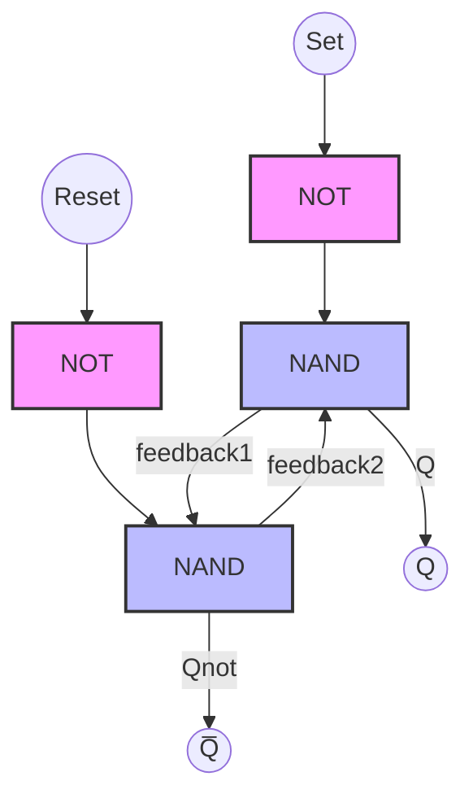
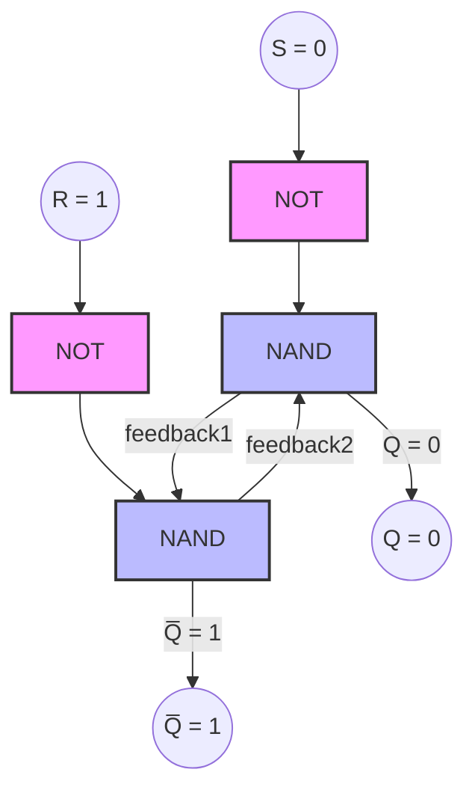

# 論理回路
## コンピュータの「細胞」
コンピュータ(coputer)とは、「計算するもの」という意味です。その計算は、全て論理回路を複雑に組み合わせることで行われています。つまり、論理回路について学ことは、コンピュータの根幹を深く、直感的に理解するのに非常に重要です。当サイトでは、以下のように学んでいきます。
1. 論理回路の基本的なパーツを理解する。
2. 基本的なパーツを組み合わせてより複雑な処理ができる回路を作る仕組みを理解します。
3. さらに、それらの複雑な回路をさらにまとめて実際に使われるIC(集積回路)ができる仕組みを理解します。また、ICには様々な種類があるので、その分類も

# 分類
分類といっても、様々な基準で分類することができます。ただ、最も一般的な分類方法は根本的な**構造の違い**による分類です。
* ## [構造による分類]
* ### [組み合わせ回路](/b/cs/h/lc/combinational)
* ### [順序回路](/b/cs/h/lc/sequential)
* ## [集積度による分類](/b/cs/h/lc/integrity)
* ## [使い道による分類](/b/cs/h/lc/purpose)
* ## [カスタマイズ度合いによる分類](/b/cs/h/lc/customizability)

## Sequential circuits

半加算器の時と同じ2つの入力に加えて、下の桁の繰り上がりがあった場合の入力$$C’$$を設ける。

C: c of carry桁あがりした2桁目の数に当たる出力

S: SumのS.1桁目の数に当たる出力

$$
\text{Input(A,B,C')}\longmapsto \text{Full Adder} \longmapsto \text{Output(C,S)}
$$

最大出力は$1+1=11$である。よって、出力は2つでも大丈夫。

### **Registers**

- **Definition**: Registers are small storage devices that hold data. They are made up of a group of flip-flops, each storing a single bit of information.
- **Function**: Registers temporarily hold data, such as the intermediate results of computations, instructions, or addresses. They are a fundamental component in the architecture of CPUs and other digital systems.
- **Types**: Common types include data registers, address registers, and special-purpose registers like instruction registers.

### **Counters**

- **Definition**: Counters are a type of sequential circuit that goes through a prescribed sequence of states upon the application of input pulses.
- **Function**: Counters are used to count the number of occurrences of an event. They can count up, count down, or both. They are widely used in digital clocks, timers, and in the control units of processors.
- **Types**: There are various types of counters, such as binary counters, decade counters, and ring counters.

### **Shift Registers**

- **Definition**: Shift registers are a type of register where the stored data can be shifted left or right. They are made up of a series of flip-flops connected in a chain.
- **Function**: Shift registers are used to store data and move it to the left or right. They are commonly used for data serialization, data transfer, and in various digital communication systems.
- **Types**: Shift registers can be classified as serial-in-serial-out (SISO), serial-in-parallel-out (SIPO), parallel-in-serial-out (PISO), or parallel-in-parallel-out (PIPO).

### **Finite State Machines (FSMs)**

- **Definition**: A Finite State Machine (FSM) is a computational model used to design sequential logic circuits. It consists of a finite number of states, transitions between those states, and actions.
- **Function**: FSMs are used to model systems that can be in exactly one of a finite number of states at any given time. FSMs are integral in designing control logic in hardware, software protocols, and more.
- **Types**: There are two main types of FSMs:
    - **Mealy Machine**: Output depends on both the current state and the input.
    - **Moore Machine**: Output depends only on the current state.

### **Latches**

Yes, there are several types of latches other than the SR latch. Here are the most common ones:

### 1. **D Latch (Data or Delay Latch)**

- **Description**: The D latch is a modification of the SR latch that ensures the inputs S and R are never equal simultaneously. It has a single data input (D) and a clock or enable signal (often labeled as E or CLK).
- **Function**: When the enable signal is active, the output Q takes the value of the data input (D). When the enable signal is inactive, the output remains unchanged.
- **Application**: The D latch is commonly used to store a single bit of data and is often used in memory devices and flip-flops.

### 2. **JK Latch**

- **Description**: The JK latch is a refinement of the SR latch that eliminates the indeterminate state. It has two inputs, labeled J and K, as well as a clock or enable input.
- **Function**: Depending on the values of J and K:
    - If J = 1 and K = 0, the latch sets (Q = 1).
    - If J = 0 and K = 1, the latch resets (Q = 0).
    - If J = 1 and K = 1, the latch toggles its current state.
    - If J = 0 and K = 0, the latch retains its current state.
- **Application**: The JK latch is used in digital circuits where toggling behavior is needed, such as in counters and flip-flops.

### 3. **T Latch (Toggle Latch)**

- **Description**: The T latch is derived from the JK latch by tying the J and K inputs together to form a single input, called T.
- **Function**: When the T input is 1 and the enable signal is active, the output toggles (switches between 0 and 1). If T = 0, the latch retains its current state.
- **Application**: The T latch is used in applications requiring a toggling action, such as in binary counters.

### 4. **Gated SR Latch**

- **Description**: A gated SR latch is an extension of the basic SR latch with an additional enable or clock input. This ensures that the latch only changes state when the enable signal is active.
- **Function**: The output changes according to the S and R inputs only when the enable signal is active; otherwise, it holds its state.
- **Application**: This is used in situations where control over when the latch can change is required.

This circuit is called an "SR latch." Specifically, it is an SR latch that uses NAND gates.

These latches serve as the foundation for more complex storage elements in digital electronics, such as flip-flops, which are edge-triggered versions of latches.

- **S (Set)**: When the input is 1, the output Q becomes 1 (set).
- **R (Reset)**: When the input is 1, the output Q becomes 0 (reset).
This latch retains or changes its output depending on the S and R inputs, but it has the characteristic that when both S and R are 1 simultaneously, the output becomes indeterminate.
    
    ```mermaid
    graph TB
        S((S)) --> A[NOR]
        R((R)) --> B[NOR]
        A -- Q --> D((Q))
        B -- Qnot --> E((Q̅))
        A -- feedback1 --> B
        B -- feedback2 --> A
        style A fill:#f9f,stroke:#333,stroke-width:2px;
        style B fill:#f9f,stroke:#333,stroke-width:2px;
    ```
    
- **Definition**: Latches are basic storage elements that store one bit of data. Unlike flip-flops, latches are level-triggered devices.
- **Function**: A latch maintains its output state until the input changes, effectively "latching" onto a value. They are used in circuits where data needs to be stored temporarily, but the timing of when the data is captured is not critical.
- **Types**: Common types of latches include the SR (Set-Reset) latch, D (Data) latch, and JK latch.

### RS Flip-flop

使う時のイメージ

1. SetかResetを入力。あるいはどちらも入力しない。どちらも入力しない、というのはしないという同意がある（どちらも入力したら値が定まらないため）。
2. そのまま($Q$)か否定($\bar{Q}$)かを出力
    1. Setを入力→$Q$
    2. Resetを入力→$\bar{Q}$

Reset, Setという二つのsignal-patternで、記憶させる値を切り替える。

| S | R | Q | Q̅ |
| --- | --- | --- | --- |
| 1 | 0 | 1 | 0 |
| 0 | 1 | 0 | 1 |
| 0 | 0 | Q | Holds Value |
| 1 | 1 | ? | Undefined |


For the first image:

- **S = 1, R = 0**


For the second image:

- **S = 0, R = 1**



### English Translation:

- **S = 1, R = 0:**
    - Set (`S`) input is `1`.
    - Reset (`R`) input is `0`.
    - Output `Q` is `1`.
    - Output `Q̅` (Q bar) is `0`.
- **S = 0, R = 1:**
    - Set (`S`) input is `0`.
    - Reset (`R`) input is `1`.
    - Output `Q` is `0`.
    - Output `Q̅` (Q bar) is `1`.