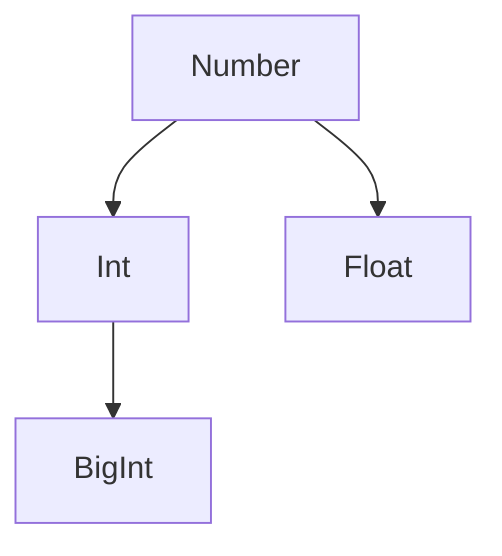

# BigInt

Literal(How to write data types in source code.): Write a number followed by n.
Value: Arbitrary-size integer.
型変換: BigInt()

不思議な立場。

To handle integers out of range of ordinary `Number` type, we need to use `BigInt` type.

The range of numbers in JavaScript is limited by the IEEE 754 double-precision floating-point format. Here are the key points:

- **Largest safe integer:** `Number.MAX_SAFE_INTEGER` (2^53 - 1 or 9,007,199,254,740,991)
- **Smallest safe integer:** `Number.MIN_SAFE_INTEGER` (-2^53 + 1 or -9,007,199,254,740,991)
- **Maximum value:** `Number.MAX_VALUE` (approximately 1.8 x 10^308)
- **Minimum value:** `Number.MIN_VALUE` (approximately 5 x 10^-324, closest to zero)