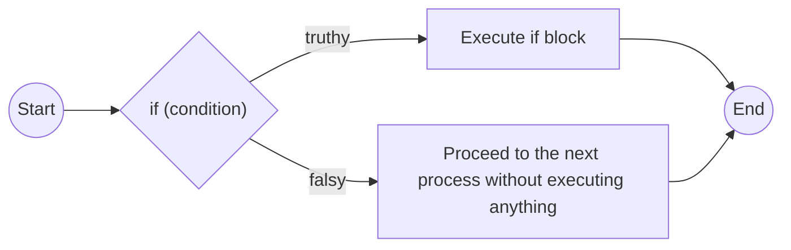
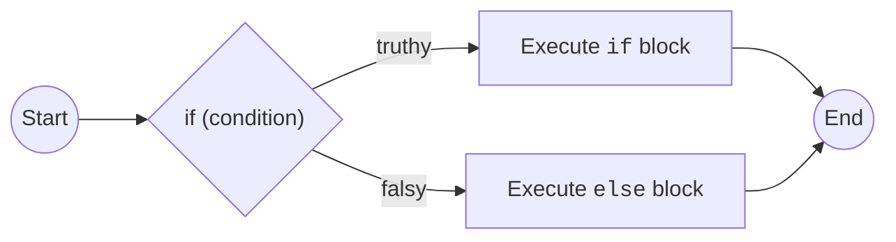
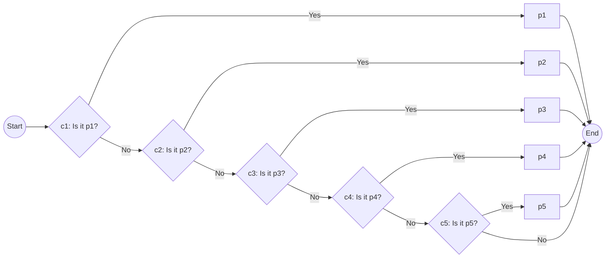
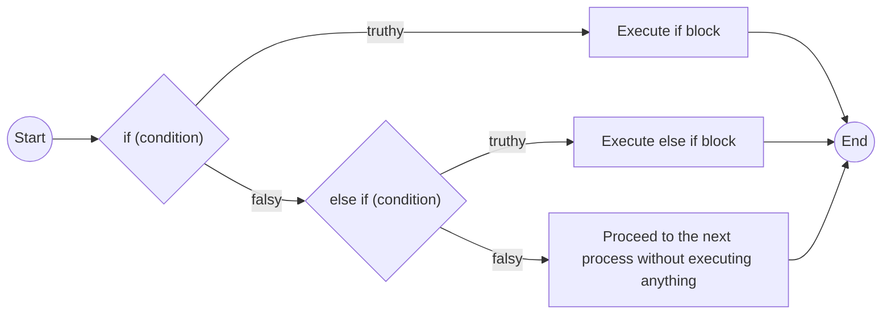
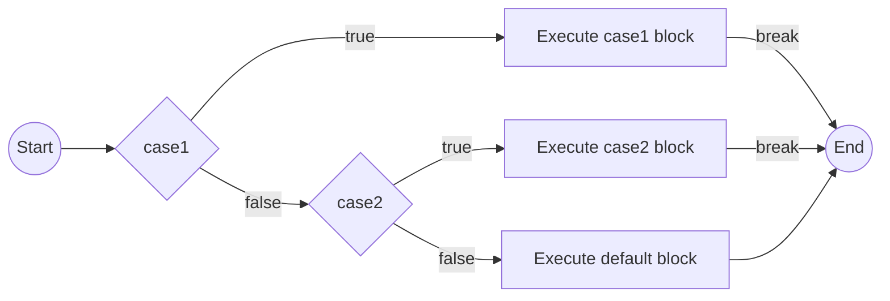
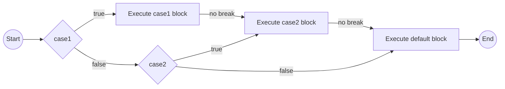

# Conditional branch

# **1. Define processing only for true condition**

Even if the condition is false, it will not result in an exception.



```jsx
if(){
	// Execute
}
```

# 2. Define processing for both true and false conditions



notations

## **2.1. Block notation (standard `if-else`)**

```jsx
if(){
	// Process for `true`
} else {
	// Process for `false`
}
```

- Ex
    
    ```jsx
    let perfectLang = "TypeScript";
    if(perfectLang === "TypeScript"){
    	console.log("You're correct.")
    } else {
    	console.log("You're wrong.")
    }
    ```
    

## **2.2. Inline notation (shorthand `if-else`)**

```jsx
if()
	// Process for `true` (only 1 line)
else
	// Process for `false` (only 1 line)
	// Process executed always (Lines from the second onward are always executed regardless of the condition's boolean value.)
```

- Ex
    
    ```jsx
    let perfectLang = "TypeScript";
    
    if(perfectLang === "TypeScript")
    	console.log("You're correct.");
    else
    	console.log("You're wrong.");
    ```
    

## **2.3. Ternary operator**

[`... ? ... : ...`](Operator%20-JS%20a1a88ba237a54b0b9d4be396649950d8/%5BExported%5DJavaScript%20Operator%20eb8d7ea1b75c4645ababc6409b9ff190%20ddbe88b54fd543b29afb32ba04a23724.md)

```jsx
let greeting = (perfectLang === "TypeScript") ? console.log("You're correct") : console.log("You're wrong");
```

- Ex
    
    ```jsx
    let myFavoriteLanguage = "JavaScript";
    let useHotLanguage = myFavoriteLanguage === "JavaScript"?console.log("You're stupid."):console.log("You're correct.");
    console.log(useHotLanguage);
    
    // You're stupid.
    // undefined
    ```
    
- **1.2.4. if-sentence without operators**
    
    check wether the conditional sentence is truthy or faulsy
    
    ```jsx
    let (condition){
      console.log("Truthy!");
    } else {
      console.log("Faulsy!");
    }
    ```
    

# 3. Conditional branching with more than two options





## 3.1. Nested `if-else`

```jsx
if(firstCondition){
	// Process for true
} else if(secondCondition) {
	// Process for true
}
```

We can nest more `else` tags at the end

```jsx
if(firstCondition){
	// Process for true
} else if(secondCondition) {
	// Process for true
} else {
	// Process for both false
}
```

and more conditions

さまざまな条件が並列になっているように見えるが、実際はfaulsyだった処理のブロックの入れ子が続いていつのだ。

```jsx
if(firstCondition){
	// Process for true
} else if(secondCondition) {
	// Process for true
} else if(thirdCondition) {
	// Process for true
} else if(fourthCondition) {
	// Process for true
} else if(fifthCondition) {
	// Process for true
} else if(sixthCondition) {
	// Process for true
} else if(seventhCondition) {
	// Process for true
} else if(eighthCondition) {
	// Process for true
} else if(ninthCondition) {
	// Process for true	
} 
```

## 3.2. `switch`

### 3.2.1. strict `break`



```jsx
switch(myVariable){
  case "myValue1": // if(myVariable === "myValue1")
    // Process1
    break;
  case "myValue2": // if(myVariable === "myValue2")
    // Process2
    break;
  case "myValue3": // if(myVariable === "myValue3")
    // Process3
    break;
  
  ...
  
  case "myValueK": // if(myVariable === "myValueK")
    // ProcessK
    break;
  
  ...
  
  default "myValueN": // if(myVariable === "myValueN")
    // ProcessN
}
```

### 3.2.2. no `break` (not recommended/fall-through)



```jsx
switch(myVariable){
  case "myValue1": // if(myVariable === "myValue1")
    // Process1
  case "myValue2": // if(myVariable === "myValue2")
    // Process2
  case "myValue3": // if(myVariable === "myValue3")
    // Process3
  
  ...
  
  case "myValueK": // if(myVariable === "myValueK")
    // ProcessK
  
  ...
  
  default "myValueN": // if(myVariable === "myValueN")
    // ProcessN
}
```