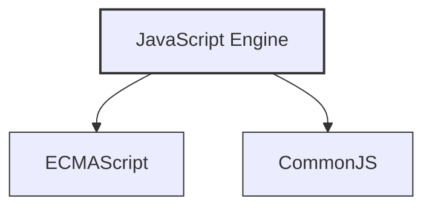
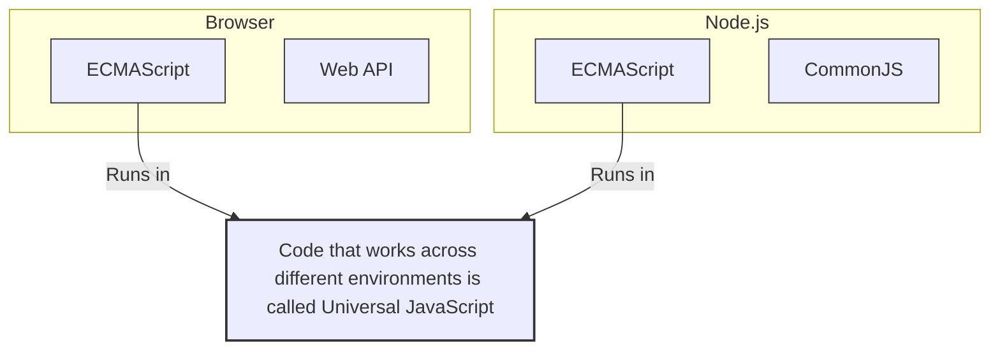

JavaScriptをローカルで実行するためのソフトウェア。これによってブラウザだけでなくスマホアプリやデスクトップアプリでもJavaScriptを実行できるようになった。

**Node.js**のJavaScriptでは、ECMAScriptに加えてCommonJSというモジュールを使うことができる。

Vue.jsやReact.jsのようなフレームワークはNode.jsとは根本的に違うものなので混同しないように。

ブラウザからJavaScriptを実行する能力のみを抽出
