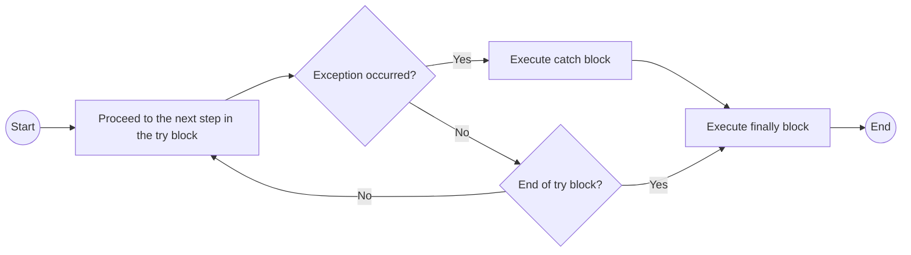

# Exception handling

[Error type in JavaScript](Data%20type%20-JS%20e3e7bcf9752a4eb58f079adc2827809e/Non-primitive%20type%20(reference%20types)%20in%20JavaScript%20c71f4f8d849641fc81c690dbe460098e/Error%207235d0371a844669b9635cf8baaaa4ce/Error%20type%20in%20JavaScript%2099e3b83d9f3541528ef6089ebb4d1b32.md)

<aside>
💡

It is done to prevent the unfortunate situation where the entire system comes to a halt due to a trivial error.

</aside>

```jsx
try {
	// もし例外が発生した場合、エラーの内容が`catch`の引数にnon-primitive dataとして格納される。
	// 複数行の処理の場合、エラー(regardless of explicit/implicit error)が起きた行以降の処理はされない。
} catch(exceptionIdentifier) {
	// Tryブロックで例外が発生した時に行う処理
	// Tryブロックで生じた例外の内容`exceptionIdentifier`はコンソールに表示するなりDOMに書くなり自由に使える。
	// また、Objectなのでエラーコードの特定の内容だけ取得することもできる
} finally {
	// この時、「例外識別子」というnon-primitive typeのデータが渡される。
}
```

The process is executed

If process inside `try` succeeds

1. process inside `finally` executed
2. `throw Identifier;` provokes explicit exception.
    1. This time, Identifier will obtain error object

If process inside `try` fails

1. `exceptionIdentifier` will get the error message as non-primitive data
2. process inside `catch` executed
3. process inside `finally` executed



`throw`

- In JavaScript, developer can cause exception intetionally by using `throw`.
    
    ```jsx
    function test() {
        console.log("Before throwing an error");
        throw new Error("This is an error thrown outside of a try block.");
        console.log("This line will never be executed.");
    }
    
    test();
    console.log("This line will also not be executed.");
    
    // Before throwing an error
    // Uncaught Error: This is an error thrown outside of a try block.
    ```
    
    If `throw` comes outside `try`, the data after it will be displayed as error message. Any type of data can come next to `throw`.
    
- Identifier (regardless of data-type) next to `throw` inside `try` will be passed as parameter of process inside `catch`.
    
    `Error` objects can come next to  `throw`.
    
    ```jsx
    try {
    	throw errorValue;
    } catch(error){
    		// `error` can be used as variable/constant with value `errorValue`
    }
    ```
    

If process inside `try` succeeds

If process inside `try` fails

- Example
    
    ```jsx
    try {
        const num = "3";
    
        if(typeof num !=="number"){
            throw "numは数値じゃないみたいじゃのぉ";
        }
        console.log(`${num}x5=${num*5}`);
    } catch(error){
        console.error(error);
    }
    
    // numは数値じゃないみたいじゃのぉ
    // undefined
    ```
    
    > In the above code, `console.log()` returns exception because string can’t be mutiplied by number.
    > 
    
    ```jsx
    try {
        const num = 3;
    
        if(typeof num !=="number"){
            throw "numは数値じゃないみたいじゃのぉ";
        }
        console.log(`${num}x5=${num*5}`);
    } catch(error){
        console.error(error);
    }
    
    // 3x5=15
    // undefined
    ```
    
    > In the above code, `console.log()` was successful.
    >