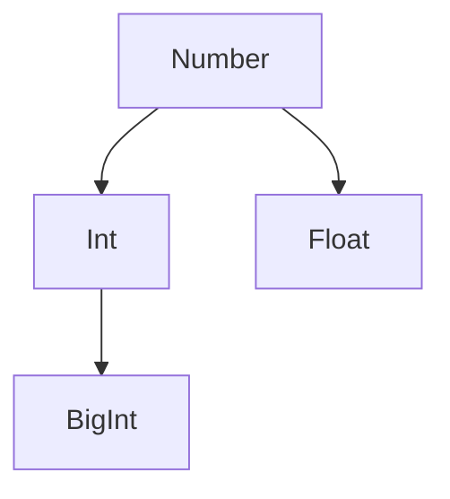

# Data type -JS

Data Types Available in JavaScript

# Primitive type in JavaScript

[Wrapper Object](Data%20type%20-JS%20e3e7bcf9752a4eb58f079adc2827809e/Non-primitive%20type%20(reference%20types)%20in%20JavaScript%20c71f4f8d849641fc81c690dbe460098e/Object%5BCollection%5D%20df1ac27007f84c68be6cac12b06e8f0a/Built-in%20object%2071526c5d4bc3489fa7515f14d1ae7378/Wrapper%20Object%20b47f7434baa34a0aae11464d78ef5e65.md)

String | Text string: Enclosed in single quotes (' '), double quotes (" "), or backticks (` `).
Number | Numeric value:
A number from ($-(2^{53}-1)$ to $(2^{53}-1)$ (integer or floating-point number).
$\text{Cf. }2^{53} - 1$ = $9007199254740991$.
BigInt | Arbitrary-size integer.
Boolean | True/false value.
null | Null value: Represents an empty (non-existent) value.
undefined | Undefined: Represents a value that is not defined.
Symbol | Symbol: A unique and immutable value.

### String
Escaped Sequences List
| Escaped Sequence | Meaning |
| --- | --- |
| `\b` | Backspace |
| `\t` | Horizontal Tab |
| `\v` | Vertical Tab |
| `\n` | New Line |
| `\r` | Carriage Return |
| `\f` | Form Feed |
| `\"` | Double Quote |
| `\'` | Single Quote |
| `\`` | Backquote |
| `\\` | Backslash |
| `\0` | NULL Character |
| `\xXX` | Latin-1 Character Represented by 2 Hex Digits |
| `\uXXXX` | Unicode Character Represented by 4 Hex Digits |
| `\u{XXXXXX}` | Unicode Character Represented by Code Points |

### Number
In JS, Integer and Float aren’t distinguished.

#### Float number

`0.n` or `.n`

#### Exponent where base is 10

`eN` represents $10^N$ where $N\in\mathbb{Z}$

Example(to express $3\times 10^4$)

```jsx
console.log(3e4);
```


`e+15` represents $10^{15}$ here thus the above number indicates $9.0071993\times 10^{15}$

## Decimal(Start with number not 0)

## Binary(Start with `0b`/`0B`)

## Octal(Start with `0o`/`0O`)

## Hexadecimal(Start with `0x`/`0X`)


### BigInt


To handle integers out of range of ordinary `Number` type, we need to use `BigInt` type.

The range of numbers in JavaScript is limited by the IEEE 754 double-precision floating-point format. Here are the key points:

- **Largest safe integer:** `Number.MAX_SAFE_INTEGER` (2^53 - 1 or 9,007,199,254,740,991)
- **Smallest safe integer:** `Number.MIN_SAFE_INTEGER` (-2^53 + 1 or -9,007,199,254,740,991)
- **Maximum value:** `Number.MAX_VALUE` (approximately 1.8 x 10^308)
- **Minimum value:** `Number.MIN_VALUE` (approximately 5 x 10^-324, closest to zero)

### Boolean
We dive deeper into in the section of conditional branch.

### null
Explicitly indicates that it does not hold a reference, or that the contents of the variable are empty.


- `typeof null`
    
    NetscapeのJavaScriptでは、`typeof null === 'object'`となるバグがあった。
    
    しかし、このバグを修正するとJavaScriptコードに影響が出るため修正が見送られ、現在の挙動(typeof nullがobjectを返す)使用になっています。
    
    This is a known quirk in JavaScript.

### undefined
When the variable or constant without value is called, the program add undefined type to it.

### Symbol
3.6.6　シンボル（Symbol） レベルアップ 初心者はスキップ可能 使用頻度低 シンボル（Symbol）は、ES6で追加された非常に特殊な型です。シンボル型はプリミティブ型に分類されますが、オブジェクトに深く関係するため、ここで説明していきます。 シンボルは、オブジェクトのプロパティに設定するための一意の値を生成するときに使います。「一意」とは、決して他の値と重複しないことが担保されていることを意味します。そのため、シンボルを使って設定したプロパティは、決して他のプロパティと重複することがありません。 それでは、シンボルの定義方法から確認していきましょう。 構文 シンボルの定義方法  let 変数名 = Symbol( [ "ラベル" ] );
ラベル　：コンソールでデバッグするときに表示されるラベル名。ラベル名が同じでも、シンボルの値は異なる点に注意が必要です。
シンボルを定義するには、Symbol()を実行します。このとき、ラベルを渡すことができますが、ラベルの値が同じでも生成される値は異なります。ラベルは、あくまでコンソール上でシンボルを区別するための目印です。 シンボルに渡すラベルは目印

console.log( Symbol() );

Symbol() ───どのシンボルかわからない！
console.log( Symbol( "ラベルは目印" ) );
Symbol( ラベルは目印 ) ───どのシンボルかわかる！ それでは、オブジェクトのプロパティとしてシンボルを使ってみましょう。 シンボルを使ってプロパティを設定（symbol.html）  let mySymbl1 = Symbol(); ───あるSymbolの値
let mySymbl2 = Symbol(); ───別のSymbolの値
　
const obj = {
[ mySymbl1 ]: "値１", ───シンボルをキーにプロパティを定義
 mySymbl2  { console.log( "こんにちは" ); } ───シンボルをキーにメソッドを定義
};
　
console.log( obj[ mySymbl1 ] ); ───シンボルをキーに値を取得
値１
　
obj mySymbl2 ; ───シンボルをキーにメソッドを実行
こんにちは シンボルを使ってプロパティを指定する場合は、必ずブラケット記法を使用する必要があります。ドット記法では指定できないので注意しましょう。


## Data type table
| Data Type | Literal(How to write data types in source code.) | Concatinate | 型変換 |
| --- | --- | --- | --- |
| **String** | `‘’`, `“”`, ```` (ES6 and later. variables or constants can be inserted into ``${ }``)
If the opening and closing quotes do not match, an error will occur.
シングルクォートやダブルクォートを文字列に含める時は、文字列に含めたいクォートの種類と別のクォートで全体を囲む。
もしダブルクォートの中でダブルクォートを文字として表示したい場合には、`\`を使う。 | `+`を間につける | `String()` |
| **Number** | Write the number as is. |  | `Number()` (Error: `NaN`) |
| **BigInt** | Write a number followed by `n`. |  | `BigInt()` |
| **Boolean** | `true` / `false` |  | `Boolean()` |
| **null** | `null` |  | `= null;` |
| **undefined** |  |  | `= undefined;` |
| **Symbol** |  |  | `Symbol()` |


## `null` and `undefined`

- **`null`**: It is an intentional absence of any object value. It's an assignment value that can be assigned to a variable to indicate that it has no value.
- **`undefined`**: This means that a variable has been declared but has not yet been assigned a value. It can also mean that a property does not exist or that a function does not return a value.

not directly stored in the memory location of a variable, but rather hold a reference to the memory location where the data is actually stored.

# 2. Non-primitive type (reference types) in JavaScript

## 2.1. Object and Map

|  | Object | Map |
| --- | --- | --- |
| Type of key | Only string(necessary when invalid string) | Any type can be used as key |
| Method | Available | Unavailable |
| Utilization of `for...of...` iteration | No | Yes |
| Management of length | Unavailable | Available |

## 2.1.1. Map and WeakMap

## 2.2. Array and Set

## 2.2.1. Set and WeakSet


## `null` and `undefined`

- **`null`**: It is an intentional absence of any object value. It's an assignment value that can be assigned to a variable to indicate that it has no value.
- **`undefined`**: This means that a variable has been declared but has not yet been assigned a value. It can also mean that a property does not exist or that a function does not return a value.

not directly stored in the memory location of a variable, but rather hold a reference to the memory location where the data is actually stored.

# 2. Non-primitive type (reference types) in JavaScript

## 2.1. Object and Map

|  | Object | Map |
| --- | --- | --- |
| Type of key | Only string(necessary when invalid string) | Any type can be used as key |
| Method | Available | Unavailable |
| Utilization of `for...of...` iteration | No | Yes |
| Management of length | Unavailable | Available |

## 2.1.1. Map and WeakMap

## 2.2. Array and Set

## 2.2.1. Set and WeakSet

[Non-primitive type (reference types) in JavaScript](Data%20type%20-JS%20e3e7bcf9752a4eb58f079adc2827809e/Non-primitive%20type%20(reference%20types)%20in%20JavaScript%20c71f4f8d849641fc81c690dbe460098e.csv)

1. Initizalization
2. Manipulation
    1. Obtain
    2. Edit(Change)
    3. Add
    4. Delete

# Dynamic and Static typing

Transpile to **TypeScript**

How to check type of data

# Implicit type-change

`+` String

`-`: Number
# Dynamic and Static typing

Transpile to **TypeScript**

How to check type of data

# Implicit type-change

`+` String

`-`: Number
1. Initizalization
2. Manipulation
    1. Obtain
    2. Edit(Change)
    3. Add
    4. Delete
