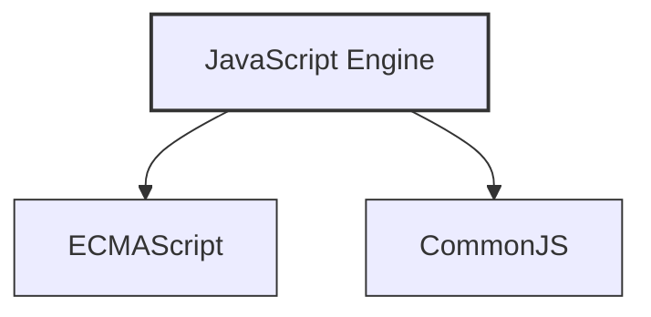
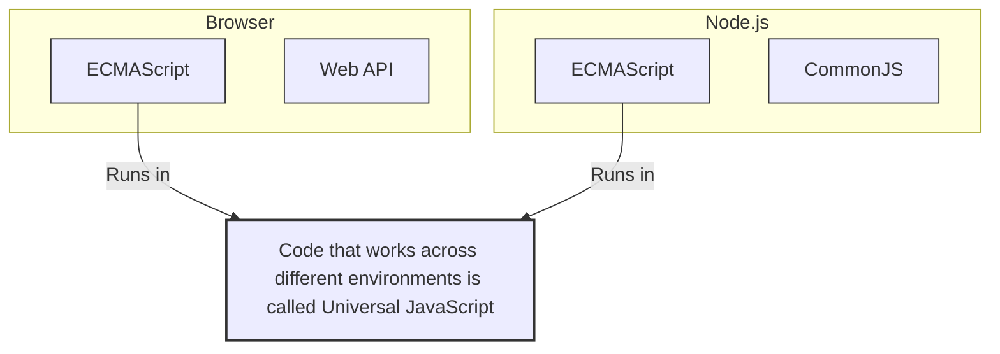

# Node.js

JavaScriptを [Browser](../Browser%208e0b390f39294b76a38d3c65956d6c47.md) なしで実行するためのソフトウェア。これによって [Browser](../Browser%208e0b390f39294b76a38d3c65956d6c47.md) だけでなくスマホアプリやデスクトップアプリでもJavaScriptを実行できるようになった。

**Node.js**のJavaScriptでは、ECMAScriptに加えてCommonJSというモジュールを使うことができる。

Vue.jsやReact.jsのようなフレームワークはNode.jsとは根本的に違うものなので混同しないように。

ブラウザからJavaScriptを実行する能力のみを抽出

[Install Node.js](Node%20js%20e33a305ff9374888ae898195a7565a17/Install%20Node%20js%20106496eb7c90807bb143c27ef3b7c6f5.md)

[Execute the `.js` file on Terminal](Node%20js%20e33a305ff9374888ae898195a7565a17/Execute%20the%20js%20file%20on%20Terminal%20106496eb7c9080929bc4d34f5b64306d.md)

[Activate ES module](Node%20js%20e33a305ff9374888ae898195a7565a17/Activate%20ES%20module%20106496eb7c90802d91e8fe6570d83e1d.md)

[Manage packages](Node%20js%20e33a305ff9374888ae898195a7565a17/Manage%20packages%20106496eb7c90803f96b3d6f3a1111137.md)

- プログラムは、実行するディレクトリでしか実行できない！`package.json`をその親ディレクトリで実行しようとしてしくってたぞ、俺